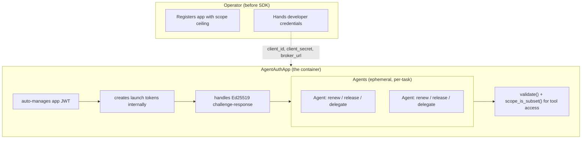

# AgentAuth Python SDK -- Product Requirements & Implementation Specification

> **Version:** 0.2 (Draft) | **Status:** Proposed | **Last Updated:** April 2026
>
> **Audience:** Implementers of the AgentAuth Python SDK and reviewers of its design.
>
> **Normative references:**
> - [OpenAPI 3.0.3 contract](../api/openapi.yaml) (API v2.0.0)
> - [API reference](../api.md)
> - [Credential model](../credential-model.md)
> - [Scope model](../scope-model.md)
> - [Roles](../roles.md)
> - [Implementation map](../implementation-map.md)

---

## 1. Executive Summary

Third-party Python developers who integrate AI agents with AgentAuth today must implement raw HTTP calls, Ed25519 key management, and nonce-signing ceremonies manually using `requests` and `cryptography`. The current guidance in [Getting Started: Developer](../getting-started-developer.md) acknowledges this gap: _"There is no AgentAuth SDK yet."_

This document specifies a typed Python SDK (`agentauth`) that makes the app-and-agent runtime ergonomic without altering the broker's security model. The app is the developer's container: it authenticates with the broker, creates agents within its scope ceiling, checks agent scope before granting tool access, and manages agent token lifecycle. Agents are ephemeral per-task principals that live inside the app and derive their authority from it.

Everything above the app -- admin secret, admin auth, app registration and CRUD, operator-level revocation, and audit queries -- is the operator's domain and is excluded from this SDK entirely.

---

## 2. Product Boundary

### 2.1 Who This SDK Is For

The third-party developer. The operator has already:

1. Deployed the AgentAuth broker.
2. Registered the developer's app with a scope ceiling via `aactl` or the admin API.
3. Handed the developer three things: a `client_id`, a `client_secret`, and the broker URL.

The SDK starts from that handoff. The developer never holds the admin secret, never registers or manages apps, and never performs operator-level revocation or audit queries.

### 2.2 Endpoints In Scope

| Endpoint | Purpose in SDK |
|----------|----------------|
| `POST /v1/app/auth` | Authenticate as the app (managed internally by the SDK) |
| `POST /v1/app/launch-tokens` | Create launch tokens for agents (managed internally by `create_agent()`) |
| `GET /v1/challenge` | Obtain cryptographic nonce for agent registration (managed internally) |
| `POST /v1/register` | Register an ephemeral agent via Ed25519 challenge-response |
| `POST /v1/token/validate` | Verify a token via the broker |
| `POST /v1/token/renew` | Renew an agent token (predecessor revoked automatically) |
| `POST /v1/token/release` | Agent self-revokes on task completion |
| `POST /v1/delegate` | Create a narrower-scoped token for another registered agent |
| `GET /v1/health` | Broker health check (convenience) |

### 2.3 Endpoints Excluded (Operator Domain)

These belong to the operator and the `aactl` CLI. They are not in this SDK:

| Endpoint | Why excluded |
|----------|-------------|
| `POST /v1/admin/auth` | Requires admin secret; operator-only |
| `POST /v1/admin/launch-tokens` | Bootstrap/break-glass path; not the production flow |
| `POST/GET/PUT/DELETE /v1/admin/apps/*` | App lifecycle is operator policy, not developer runtime |
| `POST /v1/revoke` | Operator-level kill switch across 4 granularity levels |
| `GET /v1/audit/events` | Operator observability; requires `admin:audit:*` scope |

---

## 3. Architectural Truths

These facts are derived from the broker implementation and are non-negotiable constraints on the SDK design.

### 3.1 The App Is the Agent Container

A broker can serve multiple apps. Each app has its own scope ceiling, its own credentials, and its own agents. The app is not a peer of the agent -- it is the container. Agents are created by the app, derive their authority from the app's ceiling, and use tools that the app controls.

The production authority chain:

```
App scope ceiling (set by operator at registration)
    |
    v
App JWT (obtained via POST /v1/app/auth with client_id + client_secret)
    |   scope ceiling enforced on every launch token creation
    v
Launch token (opaque 64-char hex string, not a JWT)
    |   agent's requested_scope must be subset of launch token's allowed_scope
    v
Agent JWT (sub = spiffe://{trustDomain}/agent/{orchID}/{taskID}/{instanceID})
    |   delegated scope can only narrow
    v
Delegated JWT (narrower scope, max depth 5)
```

**Source:** `AppSvc.AuthenticateApp` in `internal/app/app_svc.go` issues the app JWT with `sub: "app:{appID}"` and scopes `app:launch-tokens:*`, `app:agents:*`, `app:audit:read`. Ceiling enforcement happens in `AdminHdl.handleCreateLaunchToken` in `internal/admin/admin_hdl.go`, which checks `authz.ScopeIsSubset(req.AllowedScope, appRec.ScopeCeiling)` when the caller's `claims.Sub` starts with `app:`.

### 3.2 Agents Are Ephemeral Per-Task Principals

Each `POST /v1/register` call mints a fresh SPIFFE identity:

```
spiffe://{trustDomain}/agent/{orchID}/{taskID}/{instanceID}
```

- `trustDomain` is **operator-owned** — configured via `AA_TRUST_DOMAIN` (default `"agentauth.local"`). The developer never supplies it; the broker injects it at registration time.
- `orchID` and `taskID` are **developer-supplied** at registration time (see [Choosing `orch_id` and `task_id`](#choosing-orch_id-and-task_id) below).
- `instanceID` is **broker-generated** (16 random hex chars), unique per registration.
- The app is **not** in the SPIFFE path. The agent's identity is its own principal. But the agent's authority (its scope) is derived entirely from the app's ceiling. Without the app, the agent has no scope and cannot register.

The `AgentRecord` stored by the broker carries an `AppID` field inherited from the launch token, preserving provenance for audit.

**Source:** `identity.NewSpiffeId` in `internal/identity/spiffe.go`; `IdSvc.Register` in `internal/identity/id_svc.go` (line 200: `NewSpiffeId(s.trustDomain, req.OrchID, req.TaskID, instanceID)`; line 236: `AppID: ltRec.AppID`).

### 3.3 Launch Tokens Are Opaque Hex Strings

Launch tokens are 64-character random hex strings, not JWTs. The broker stores a policy record mapping the token to `allowed_scope`, `max_ttl`, `single_use`, `app_id`, and expiry metadata. The OpenAPI description says "JWT launch token" in one place -- this is inaccurate. Launch tokens are an internal implementation detail of agent creation; the SDK does not surface them to the developer unless they use the advanced API.

**Source:** `AdminSvc.CreateLaunchToken` in `internal/admin/admin_svc.go` generates `hex.EncodeToString(32 random bytes)`.

### 3.4 Scope Can Only Narrow

`authz.ScopeIsSubset` runs at every trust boundary:

1. App creates launch token: `allowed_scope` must be subset of app's ceiling.
2. Agent registers: `requested_scope` must be subset of launch token's `allowed_scope`.
3. Agent delegates: delegated `scope` must be subset of delegator's scope.
4. Broker enforces route access: required scope must be covered by token's scope.

Scope format is `action:resource:identifier`. The `*` wildcard in the identifier position covers any specific value. `ScopeIsSubset(requested, allowed)` returns true when every requested scope is covered by at least one allowed scope.

**Source:** `internal/authz/scope.go`; [Scope Model](../scope-model.md).

### 3.5 Registration Is a Tight Timing Window

- Nonces expire in **30 seconds** (`store.CreateNonce` in `internal/store/sql_store.go`).
- Launch tokens default to **30 seconds** TTL (`CreateLaunchTokenReq.TTL` default in `internal/admin/admin_svc.go`).
- The SDK must orchestrate challenge -> sign -> register without unnecessary delays.

### 3.6 Additional Behavioral Facts

- `POST /v1/register` carries the launch token in the **JSON body**, not as a Bearer header.
- `POST /v1/token/validate` **always returns HTTP 200**. The `valid` boolean discriminates success from failure.
- Revoked bearer tokens produce **403** (not 401) from the validation middleware (`internal/authz/val_mw.go`).
- `POST /v1/token/renew` has **no request body**. The Bearer token in the `Authorization` header is the input.
- `POST /v1/delegate` defaults `ttl` to **60 seconds** if omitted or non-positive (`internal/deleg/deleg_svc.go`). Maximum delegation depth is **5**.
- `agent_name` on `CreateLaunchTokenReq` is a human-readable audit label stored on `LaunchTokenRecord`. It does **not** appear in the agent's SPIFFE ID, JWT claims, or `AgentRecord`. The SDK auto-generates it.

### 3.7 Choosing `orch_id` and `task_id`

The developer supplies two values at agent creation time that become permanent segments in the agent's SPIFFE identity and JWT claims. Choosing them well matters for audit readability, revocation granularity, and multi-app traceability.

**Who supplies what in the SPIFFE ID:**

```
spiffe://{trustDomain}/agent/{orchID}/{taskID}/{instanceID}
         ▲                     ▲        ▲        ▲
         │                     │        │        └── broker-generated (16 random hex chars)
         │                     │        └── developer-supplied: task_id
         │                     └── developer-supplied: orch_id
         └── operator-configured: AA_TRUST_DOMAIN (default "agentauth.local")
```

The developer never supplies `trustDomain` or `instanceID`. The broker owns both.

#### `orch_id` — What is it?

The identifier of the orchestration system, pipeline, or application that launches agents. It groups all agents from the same source in SPIFFE IDs and audit trails.

**The app name is a natural choice**, especially in environments with multiple registered apps. If your app is called `"data-pipeline"`, using `orch_id="data-pipeline"` means every agent's SPIFFE ID starts with `spiffe://agentauth.local/agent/data-pipeline/...` — immediately traceable in logs and audit events.

Other valid choices:

| Scenario | Example `orch_id` |
|----------|-------------------|
| Named app in a multi-app environment | `"data-pipeline"`, `"customer-analyzer"` |
| LangChain pipeline | `"langchain-rag-pipeline"` |
| CrewAI crew | `"crewai-research-crew"` |
| Custom orchestrator | `"order-processor"`, `"invoice-bot"` |
| Dev/testing | `"dev-local"`, `"integration-test"` |

#### `task_id` — What is it?

The identifier of the specific unit of work this agent was created to perform. It can be a random UUID, an incrementing counter, a job ID from your queuing system, or any string that uniquely identifies the task.

| Strategy | Example `task_id` | When to use |
|----------|-------------------|-------------|
| Random UUID | `"f47ac10b-58cc-4372"` | When you don't have a natural ID; always safe |
| Incrementing counter | `"task-0001"`, `"task-0002"` | Simple sequential workflows |
| Job/request ID from your system | `"job-2026-04-06-batch-17"` | When your system already tracks work units |
| Meaningful identifier | `"customer-analysis-q4"` | When audit readability matters |

**The critical consideration is revocation granularity.** `POST /v1/revoke` with `level: "task"` invalidates **all tokens** sharing a `task_id`. This is powerful for incident response — but it means:

- If every agent gets a unique `task_id` → task-level revocation is surgical (one agent affected).
- If multiple agents share a `task_id` → task-level revocation is broad (all those agents revoked together). This can be intentional (e.g., all agents in a batch job share one `task_id` so the whole batch can be killed at once).

#### Format constraints

- Both must be **non-empty** (the broker rejects registration with a 400 if either is missing).
- Both must be **valid SPIFFE path segments** — URL-safe characters, no `/`, no `..`. The `go-spiffe/v2` library enforces this. Alphanumeric characters, hyphens, and underscores are always safe.

#### SDK example

```python
agent = app.create_agent(
    orch_id="data-pipeline",       # app name or orchestrator name
    task_id="job-2026-04-06-001",  # your unit-of-work identifier
    requested_scope=["read:data:customers"],
)
# SPIFFE ID will be: spiffe://agentauth.local/agent/data-pipeline/job-2026-04-06-001/{random}
```

> **TECHDEBT:** This guidance currently lives only in the SDK PRD. The broker documentation (`docs/api.md` field descriptions, `docs/concepts.md` Component 1, `docs/getting-started-developer.md`) should be updated to include this same guidance. Tracked as [SDK-012](./python-sdk-adrs.md#sdk-012-orch_id-and-task_id-guidance-is-an-sdk-responsibility).

---

## 4. SDK Architecture



The app is the single container. It manages its own authentication internally, creates agents, and gates tool access by validating agent tokens and checking scope. `validate()` and `scope_is_subset()` are module-level functions available to the app and other trusted code. Agents intentionally cannot validate themselves -- a compromised agent (e.g., via prompt injection) cannot be trusted to honestly report its own validity.

---

## 5. The Developer's Production Flow

### Step 1: Initialize the App

The developer creates an `AgentAuthApp` with the operator-provided credentials. No explicit authentication call is needed -- the SDK authenticates lazily on first use and re-authenticates automatically when the app JWT expires.

```python
from agentauth import AgentAuthApp

app = AgentAuthApp(
    broker_url="https://broker.internal.company.com",
    client_id="wb-a1b2c3d4e5f6",
    client_secret="your-client-secret",
)
```

### Step 2: Create an Agent

The developer calls `app.create_agent()`. The SDK handles the full chain internally: ensure app JWT is valid -> create launch token within ceiling -> get challenge nonce -> sign with Ed25519 -> register -> return connected `Agent`.

```python
agent = app.create_agent(
    orch_id="pipeline-001",
    task_id="task-42",
    requested_scope=["read:data:customers"],
)
```

The returned `Agent` holds the agent JWT, SPIFFE `agent_id`, scope, and a back-reference to the app.

### Step 3: Gate Tool Access

Before the agent uses a tool, the app checks its scope. Two options depending on trust requirements:

```python
from agentauth import scope_is_subset

# Fast local check (trusts scope from creation, no network call)
if scope_is_subset(["read:data:customers"], agent.scope):
    result = search_customers(agent)

# Verified check (authoritative, catches revocation)
vr = app.validate(agent.access_token)
if vr.valid and scope_is_subset(["read:data:customers"], vr.claims.scope):
    result = search_customers(agent)
```

The existing broker guidance applies: **validate first, check scope second, act third.**

### Step 4: Agent Operates

The agent uses its JWT as a `Bearer` token for downstream API calls:

```python
import httpx
resp = httpx.get("https://api/resource", headers=agent.bearer_header)
```

During the task, the agent can:

- **Renew** its token before expiry: `agent.renew()` (mutates in-place)
- **Delegate** narrower scope to another agent: `agent.delegate(delegate_to, scope)`

### Step 5: Agent Completes

```python
agent.release()
```

The broker revokes the token. The agent is no longer usable.

### What Happens Internally

The developer never sees these steps, but they happen inside `create_agent()`:

1. SDK checks if app JWT is valid; calls `POST /v1/app/auth` if needed.
2. SDK calls `POST /v1/app/launch-tokens` with `allowed_scope` = `requested_scope`, auto-generated `agent_name` from `orch_id`/`task_id`, and default TTL/single-use settings.
3. Broker enforces `ScopeIsSubset(allowed_scope, appRec.ScopeCeiling)`.
4. SDK generates Ed25519 keypair (or uses provided key).
5. SDK calls `GET /v1/challenge` for nonce.
6. SDK hex-decodes nonce, signs with private key, base64-encodes public key and signature.
7. SDK calls `POST /v1/register` with launch token, signed nonce, and requested scope.
8. Broker validates (10-step flow in `IdSvc.Register`), assigns SPIFFE ID, issues JWT.
9. SDK wraps the response into an `Agent` connected to the app.

---

## 6. Public Python API

### 6.1 Package Structure

```
agentauth/
    __init__.py          # re-exports AgentAuthApp, Agent, validate, scope_is_subset, models, errors
    _transport.py        # shared HTTP transport (internal)
    app.py               # AgentAuthApp
    agent.py             # Agent
    models.py            # typed response models (public)
    errors.py            # exception hierarchy
    crypto.py            # Ed25519 helpers
    scope.py             # scope_is_subset function
    py.typed             # PEP 561 marker
```

### 6.2 `AgentAuthApp` -- The Container

```python
class AgentAuthApp:
    """The developer's app container. Manages authentication internally,
    creates agents, validates tokens, and gates tool access.

    All agent authority flows from this app's scope ceiling.
    """

    def __init__(
        self,
        broker_url: str,
        client_id: str,
        client_secret: str,
        *,
        timeout: float = 10.0,
        user_agent: str | None = None,
    ) -> None: ...

    def create_agent(
        self,
        orch_id: str,
        task_id: str,
        requested_scope: list[str],
        *,
        private_key: Ed25519PrivateKey | None = None,
        max_ttl: int = 300,
        label: str | None = None,
    ) -> Agent:
        """Create an ephemeral agent under this app.

        Handles the full flow internally: app auth (if needed) -> launch
        token creation -> Ed25519 challenge-response -> registration.

        orch_id and task_id become part of the agent's SPIFFE identity.
        requested_scope must be a subset of the app's scope ceiling.
        private_key: provide an existing key or let the SDK generate one.
        label: optional audit label for the launch token (auto-generated
               from orch_id/task_id if omitted).

        Returns a connected Agent with lifecycle methods.
        """
        ...

    def validate(self, token: str) -> ValidateResult:
        """POST /v1/token/validate -- verify any token via the broker.

        Use this to check an agent's token before granting tool access.
        Always succeeds at HTTP level (200). Returns a ValidateResult
        with valid=True and claims, or valid=False and an error string.

        Convenience shortcut for agentauth.validate(self.broker_url, token).
        """
        ...

    def health(self) -> HealthStatus:
        """GET /v1/health -- broker health check."""
        ...
```

**Internal behavior:**

- App JWT lifecycle is fully internal. The SDK calls `POST /v1/app/auth` on first need and re-authenticates automatically when the JWT expires.
- `create_agent()` calls `POST /v1/app/launch-tokens` internally. The `agent_name` field required by the broker is auto-generated from `f"{orch_id}/{task_id}"` (or the `label` parameter). `allowed_scope` on the launch token defaults to `requested_scope`.
- Launch tokens, app sessions, and challenges are never exposed to the developer in the standard API.

### 6.3 `Agent` -- Ephemeral, Connected to App

```python
class Agent:
    """An ephemeral agent registered under an AgentAuthApp.

    Created by AgentAuthApp.create_agent(). Holds the agent JWT and
    a back-reference to its parent app for transport and re-registration.
    """

    agent_id: str          # SPIFFE URI
    access_token: str      # current JWT (updated by renew)
    expires_in: int        # seconds until expiry (from last issue/renew)
    scope: list[str]       # granted scope
    task_id: str
    orch_id: str

    @property
    def bearer_header(self) -> dict[str, str]:
        """Returns {"Authorization": "Bearer <token>"} for HTTP requests."""
        ...

    def renew(self) -> None:
        """POST /v1/token/renew -- renew this agent's token in place.

        The broker revokes the current JTI and issues a replacement with
        the same scope, TTL, and subject. Updates access_token and
        expires_in on this Agent instance. The agent_id does not change.
        """
        ...

    def release(self) -> None:
        """POST /v1/token/release -- self-revoke on task completion.

        Returns None on success (broker returns 204 No Content).
        After calling release(), this agent is no longer usable.
        """
        ...

    def delegate(
        self,
        delegate_to: str,
        scope: list[str],
        *,
        ttl: int | None = None,
    ) -> DelegatedToken:
        """POST /v1/delegate -- create a scope-attenuated delegation token.

        delegate_to: SPIFFE ID of the target agent (must already be registered).
        scope: must be a subset of this agent's scope.
        ttl: delegation lifetime in seconds (broker defaults to 60 if omitted).
        Max delegation depth: 5.

        Raises AuthorizationError if scope exceeds this agent's scope.
        """
        ...

```

**Key design decisions:**

- **No `validate()` on `Agent`.** Validation is the app's responsibility, not the agent's. An agent could be compromised by prompt injection; if it can validate itself, that check is meaningless -- the compromised agent would skip it or ignore the result. Only the app (the developer's trusted code) should call `app.validate(agent.access_token)` before granting tool access.
- `renew()` mutates in-place. The agent is the same agent; only its token is refreshed. This avoids forcing the developer to juggle object references.
- `release()` marks the agent as released. Subsequent calls to `renew()` or `delegate()` raise an error.
- The `private_key` is held internally, not exposed as a public attribute.
- The back-reference to the parent `AgentAuthApp` is internal (`_app`).

### 6.4 Module-Level Functions

These are the app's tools for gating agent access. They are module-level functions so they can also be used by resource servers or other trusted code outside the `AgentAuthApp` class.

```python
def validate(broker_url: str, token: str, *, timeout: float = 10.0) -> ValidateResult:
    """POST /v1/token/validate -- verify any token via the broker.

    Always returns HTTP 200. The valid boolean discriminates success from failure.
    Returns a ValidateResult, never raises for invalid tokens.

    AgentAuthApp.validate() is a convenience shortcut that calls this function.
    The Agent class intentionally does NOT have a validate() method -- validation
    is the app's responsibility, not the agent's. A compromised agent cannot
    be trusted to validate itself.
    """
    ...

def scope_is_subset(requested: list[str], allowed: list[str]) -> bool:
    """Client-side mirror of the broker's ScopeIsSubset check.

    Returns True if every scope in requested is covered by at least one
    scope in allowed. Coverage: same action, same resource, and either
    same identifier or the allowed identifier is *.

    Use this for tool-gating: the app checks whether an agent's scope covers
    the scope required by a tool before granting access.

    This is a local convenience. The broker performs the authoritative check.
    """
    ...
```

### 6.5 Advanced / Lower-Level API

For developers who need explicit control over individual steps (e.g., pre-creating launch tokens for agents that register later, or controlling the Ed25519 key lifecycle):

```python
def get_challenge(broker_url: str, *, timeout: float = 10.0) -> Challenge:
    """GET /v1/challenge -- obtain a cryptographic nonce (30s TTL)."""
    ...

def register(
    broker_url: str,
    launch_token: str,
    orch_id: str,
    task_id: str,
    requested_scope: list[str],
    nonce: str,
    public_key_b64: str,
    signature_b64: str,
    *,
    timeout: float = 10.0,
) -> RegisterResult:
    """POST /v1/register -- register an agent with a signed nonce.

    For most cases, use AgentAuthApp.create_agent() instead.
    Returns a RegisterResult with agent_id, access_token, expires_in.
    """
    ...
```

### 6.6 Ed25519 Crypto Helpers

```python
from cryptography.hazmat.primitives.asymmetric.ed25519 import Ed25519PrivateKey

def generate_keypair() -> Ed25519PrivateKey:
    """Generate a new Ed25519 private key."""
    ...

def sign_nonce(private_key: Ed25519PrivateKey, nonce_hex: str) -> bytes:
    """Hex-decode the nonce and sign the resulting bytes.
    Returns the raw 64-byte signature.
    """
    ...

def export_public_key_b64(private_key: Ed25519PrivateKey) -> str:
    """Extract the raw 32-byte public key and base64-encode it."""
    ...

def encode_signature_b64(signature: bytes) -> str:
    """Base64-encode a raw Ed25519 signature."""
    ...
```

---

## 7. Typed Models

All models are `dataclass` with full type annotations. Field names match the broker JSON keys.

### 7.1 Agent Models (Public)

```python
@dataclass(frozen=True)
class AgentClaims:
    """Mirrors TknClaims from internal/token/tkn_claims.go."""
    iss: str              # always "agentauth"
    sub: str              # SPIFFE URI
    aud: list[str]
    exp: int              # Unix timestamp
    nbf: int              # Unix timestamp
    iat: int              # Unix timestamp
    jti: str              # unique token ID
    scope: list[str]
    task_id: str
    orch_id: str
    sid: str | None = None
    delegation_chain: list[DelegationRecord] | None = None
    chain_hash: str | None = None

@dataclass(frozen=True)
class DelegationRecord:
    agent: str            # SPIFFE ID of delegator
    scope: list[str]
    delegated_at: str     # RFC 3339
    signature: str | None = None

@dataclass(frozen=True)
class ValidateResult:
    valid: bool
    claims: AgentClaims | None = None
    error: str | None = None

@dataclass(frozen=True)
class DelegatedToken:
    access_token: str
    expires_in: int
    delegation_chain: list[DelegationRecord]

@dataclass(frozen=True)
class RegisterResult:
    """Returned by the low-level register() function."""
    agent_id: str         # SPIFFE URI
    access_token: str
    expires_in: int
```

### 7.2 Internal Models (Not Part of Public API)

These exist inside the SDK but are not exported or documented as public types:

- `_AppSession` -- app JWT + metadata (managed by `AgentAuthApp` internally)
- `_LaunchToken` -- launch token string + policy (consumed inside `create_agent()`)
- `_Challenge` -- nonce + expires_in (consumed inside `create_agent()`)

### 7.3 Observability Models (Public)

```python
@dataclass(frozen=True)
class HealthStatus:
    status: str           # "ok"
    version: str          # e.g. "2.0.0"
    uptime: int           # seconds
    db_connected: bool
    audit_events_count: int
```

### 7.4 Error Model (Public)

```python
@dataclass(frozen=True)
class ProblemDetail:
    """RFC 7807 problem detail from broker error responses."""
    type: str
    title: str
    detail: str
    instance: str
    status: int | None = None
    error_code: str | None = None
    request_id: str | None = None
    hint: str | None = None
```

---

## 8. Endpoint Behavior Matrix

| Method | Path | Auth | Python Surface | Request Body | Response Body | Status | Caveats |
|--------|------|------|----------------|-------------|---------------|--------|---------|
| `POST` | `/v1/app/auth` | None | Internal to `AgentAuthApp` | `{client_id, client_secret}` | `{access_token, expires_in, token_type, scopes}` | 200 | Rate-limited: 10 req/min per client_id, burst 3 |
| `POST` | `/v1/app/launch-tokens` | Bearer (app) | Internal to `create_agent()` | `{agent_name, allowed_scope, max_ttl?, ttl?, single_use?}` | `{launch_token, expires_at, policy}` | 201 | Ceiling enforced; 403 if scopes exceed app ceiling |
| `GET` | `/v1/challenge` | None | Internal to `create_agent()` / `get_challenge()` | -- | `{nonce, expires_in}` | 200 | Nonce expires in 30s; single-use |
| `POST` | `/v1/register` | None (launch token in body) | Internal to `create_agent()` / `register()` | `{launch_token, nonce, public_key, signature, orch_id, task_id, requested_scope}` | `{agent_id, access_token, expires_in}` | 200 | Scope checked before token consumption; launch token in JSON body, not Bearer |
| `POST` | `/v1/token/validate` | None | `validate()` / `app.validate()` (app-side only; agents cannot self-validate) | `{token}` | `{valid, claims?}` or `{valid, error}` | 200 | **Always HTTP 200**; discriminate on `valid` boolean |
| `POST` | `/v1/token/renew` | Bearer (agent) | `agent.renew()` | -- | `{access_token, expires_in}` | 200 | No request body; old JTI revoked before new token issued |
| `POST` | `/v1/token/release` | Bearer (agent) | `agent.release()` | -- | -- | 204 | Returns 204 No Content |
| `POST` | `/v1/delegate` | Bearer (agent) | `agent.delegate()` | `{delegate_to, scope, ttl?}` | `{access_token, expires_in, delegation_chain}` | 200 | delegate_to is SPIFFE ID; max depth 5; ttl defaults to 60; scopes must be subset |
| `GET` | `/v1/health` | None | `app.health()` | -- | `{status, version, uptime, db_connected, audit_events_count}` | 200 | -- |

**Cross-cutting behavior:**

- All error responses use `Content-Type: application/problem+json` with RFC 7807 `ProblemDetail` body (except `token/validate` which always returns 200).
- Revoked bearer tokens produce **403** with `"token has been revoked"`, not 401.
- Request body size limit: 1 MB on all endpoints.
- Security headers on all responses: `X-Content-Type-Options: nosniff`, `Cache-Control: no-store`, `X-Frame-Options: DENY`.

---

## 9. Error Model

### 9.1 Exception Hierarchy

```python
class AgentAuthError(Exception):
    """Base exception for all SDK errors."""

class ProblemResponseError(AgentAuthError):
    """Broker returned an RFC 7807 error response."""
    problem: ProblemDetail
    status_code: int

class AuthenticationError(ProblemResponseError):
    """401 Unauthorized -- invalid or missing credentials."""

class AuthorizationError(ProblemResponseError):
    """403 Forbidden -- scope ceiling violation or revoked token."""

class RateLimitError(ProblemResponseError):
    """429 Too Many Requests."""

class TransportError(AgentAuthError):
    """Network, DNS, timeout, or connection failure."""

class CryptoError(AgentAuthError):
    """Ed25519 key generation, signing, or encoding failure."""
```

### 9.2 Error Handling Rules

- **`POST /v1/token/validate`** invalid results are returned as a `ValidateResult` value with `valid=False`, never raised as exceptions.
- **RFC 7807 parsing:** The SDK parses `application/problem+json` bodies into `ProblemDetail`. If the body cannot be parsed, the raw body is stored in `ProblemDetail.detail`.
- **Secret redaction:** Bearer tokens, `client_secret`, and launch tokens are **never** included in log output, exception messages, or `repr()` strings, even at debug level.
- **Retry policy:** The SDK does not retry by default. Retries for idempotent operations (`GET /v1/health`, `GET /v1/challenge`) may be added in a future version. Non-idempotent operations (register, renew, delegate) must never be retried automatically because they consume one-time resources.

---

## 10. Configuration

### 10.1 Constructor Arguments

| Parameter | Type | Required | Default | Description |
|-----------|------|----------|---------|-------------|
| `broker_url` | `str` | yes | -- | Base URL of the AgentAuth broker (no trailing slash) |
| `client_id` | `str` | yes | -- | App client ID from operator |
| `client_secret` | `str` | yes | -- | App client secret from operator |
| `timeout` | `float` | no | `10.0` | HTTP request timeout in seconds |
| `user_agent` | `str \| None` | no | `"agentauth-python/{version}"` | User-Agent header value |

### 10.2 Environment Variable

| Variable | Purpose | Notes |
|----------|---------|-------|
| `AGENTAUTH_BROKER_URL` | Broker base URL | Used as fallback if `broker_url` constructor arg is not provided |

`client_id` and `client_secret` are constructor arguments only. They are never read from environment variables by default. Developers who want env-var configuration should read the variables themselves and pass them to the constructor.

### 10.3 TLS

- The SDK uses the system trust store by default via `httpx`.
- For mTLS deployments, the constructor accepts an optional `ssl_context` or `verify` parameter matching `httpx` conventions. This is a post-MVP enhancement.

---

## 11. Packaging

| Attribute | Value |
|-----------|-------|
| Package name | `agentauth` (verify PyPI availability before publish) |
| Build tool | `uv` with `pyproject.toml` |
| Python version | `>=3.10` |
| Runtime dependencies | `httpx>=0.27`, `cryptography>=42.0` |
| License | Apache-2.0 (matches repo) |
| Typing | `py.typed` marker; all public types exported from `agentauth` |
| Sync/async | **Sync-first MVP**. Async support deferred to a future milestone. |

### 11.1 `pyproject.toml` Sketch

```toml
[project]
name = "agentauth"
version = "0.1.0"
description = "Python SDK for AgentAuth ephemeral agent credentialing"
readme = "README.md"
license = "Apache-2.0"
requires-python = ">=3.10"
dependencies = [
    "httpx>=0.27",
    "cryptography>=42.0",
]

[build-system]
requires = ["hatchling"]
build-backend = "hatchling.build"

[project.optional-dependencies]
dev = [
    "pytest>=8.0",
    "pytest-httpx>=0.30",
    "ruff>=0.4",
    "mypy>=1.10",
]
```

---

## 12. Testing Requirements

### 12.1 Test Layers

| Layer | Scope | Tools |
|-------|-------|-------|
| **Unit** | Model parsing, error mapping, crypto helpers, scope utilities | `pytest` |
| **Transport-mocked** | All endpoint methods with recorded JSON fixtures | `pytest-httpx` |
| **Contract** | Full flows against local broker via Docker Compose | `pytest` + `docker compose up` |

### 12.2 Required Scenario Coverage

**App container:**
- `AgentAuthApp` auto-authenticates on first `create_agent()` call
- `AgentAuthApp` re-authenticates when app JWT expires
- Invalid credentials raise `AuthenticationError`
- Rate limit hit raises `RateLimitError`

**Agent creation (end-to-end):**
- Full `create_agent()` flow succeeds, returns `Agent` with SPIFFE `agent_id`
- Scope exceeding app ceiling raises `AuthorizationError` (403)
- Expired nonce raises appropriate error
- Consumed (single-use) launch token raises appropriate error
- Invalid Ed25519 signature raises appropriate error
- Auto-generated `agent_name` label appears in broker audit (contract test)

**Tool-gating pattern:**
- `scope_is_subset(["read:data:customers"], agent.scope)` returns `True` after creation with `["read:data:*"]`
- `app.validate(agent.access_token)` returns `ValidateResult(valid=True)` with correct claims
- `app.validate(agent.access_token)` returns `ValidateResult(valid=False)` after `agent.release()`

**Token lifecycle:**
- `agent.renew()` updates `access_token` in place; old token is no longer valid
- `agent.release()` returns `None`; subsequent `renew()` raises error
- `Agent` has no `validate()` method; validation is app-side only

**Delegation:**
- Successful delegation with narrower scope
- Delegation with scope exceeding delegator's raises `AuthorizationError`
- Delegation depth 5 succeeds; depth 6 fails

**Module-level functions:**
- `validate(broker_url, token)` works independently of any class
- `scope_is_subset(["read:data:customers"], ["read:data:*"])` returns `True`
- `scope_is_subset(["admin:revoke:*"], ["read:data:*"])` returns `False`
- Wildcard coverage rules match broker behavior

**Crypto:**
- `sign_nonce()` produces a signature the broker accepts
- `export_public_key_b64()` produces correct base64 encoding of raw 32-byte key
- Key generation produces valid Ed25519 keys

---

## 13. Documentation Requirements

### 13.1 Quickstart (in SDK README)

```python
from agentauth import AgentAuthApp, scope_is_subset

app = AgentAuthApp(
    broker_url="https://broker.internal.company.com",
    client_id="wb-a1b2c3d4e5f6",
    client_secret="your-client-secret",
)

# Create an ephemeral agent (app auth + launch token + registration handled internally)
agent = app.create_agent(
    orch_id="pipeline-001",
    task_id="task-42",
    requested_scope=["read:data:customers"],
)

print(f"Agent {agent.agent_id} ready, scope={agent.scope}")

# Check scope before granting tool access
if scope_is_subset(["read:data:customers"], agent.scope):
    import httpx
    resp = httpx.get("https://your-api/customers", headers=agent.bearer_header)

# Renew before expiry
agent.renew()

# Release when done
agent.release()
```

### 13.2 Tool-Gating Example

```python
from agentauth import AgentAuthApp, scope_is_subset

app = AgentAuthApp(broker_url="...", client_id="...", client_secret="...")

def run_tool(app: AgentAuthApp, agent, tool_name: str, required_scope: list[str]):
    """Gate tool access: validate the agent's token, check scope, then act."""

    # Option A: fast local check (trusts agent.scope, no network)
    if not scope_is_subset(required_scope, agent.scope):
        raise PermissionError(f"Agent lacks scope for {tool_name}")

    # Option B: verified check (catches revocation, authoritative)
    result = app.validate(agent.access_token)
    if not result.valid:
        raise PermissionError(f"Agent token invalid: {result.error}")
    if not scope_is_subset(required_scope, result.claims.scope):
        raise PermissionError(f"Agent lacks scope for {tool_name}")

    return execute_tool(tool_name, agent.bearer_header)
```

### 13.3 Migration Table

| Step | Before (manual) | After (SDK) |
|------|-----------------|-------------|
| Init + app auth | `requests.post(f"{BROKER}/v1/app/auth", json={...})` + manage JWT | `AgentAuthApp(broker_url, client_id, client_secret)` |
| Create launch token | `requests.post(f"{BROKER}/v1/app/launch-tokens", headers=..., json={...})` | handled internally by `create_agent()` |
| Generate keys | `Ed25519PrivateKey.generate()` + manual base64 | handled internally by `create_agent()` |
| Get challenge | `requests.get(f"{BROKER}/v1/challenge")` + parse | handled internally by `create_agent()` |
| Sign nonce | `private_key.sign(bytes.fromhex(nonce))` + base64 | handled internally by `create_agent()` |
| Register | `requests.post(f"{BROKER}/v1/register", json={...})` | handled internally by `create_agent()` |
| All 6 steps above | ~25 lines of code | `app.create_agent(orch_id, task_id, scope)` |
| Check agent scope | manual scope parsing and comparison | `scope_is_subset(required, agent.scope)` |
| Validate + scope | manual HTTP + JSON parsing | `app.validate(token)` + `scope_is_subset(...)` |
| Renew | `requests.post(...)` + replace token variable | `agent.renew()` |
| Release | `requests.post(...)` | `agent.release()` |
| Delegate | `requests.post(...)` + parse chain | `agent.delegate(delegate_to, scope)` |
| Parse errors | manual JSON parsing, inconsistent | automatic `ProblemResponseError` with typed `ProblemDetail` |

### 13.4 Security Notes

The SDK provides transport and ergonomics. It does not replace the broker's security model:

- **The broker is the authority.** All scope checks, token verification, and revocation happen server-side. The SDK's `scope_is_subset()` is a local convenience for pre-flight checks, not a security boundary.
- **Token validation is always remote.** The SDK calls `POST /v1/token/validate` on the broker. It does not perform local JWT verification. This is intentional: local verification requires managing the broker's signing key material and is a separate trust decision.
- **Secrets are never logged.** The SDK redacts `client_secret`, launch tokens, and `access_token` values from all log output, `repr()` strings, and exception messages.
- **No automatic retry on non-idempotent operations.** Registration, renewal, and delegation consume one-time resources and must not be retried transparently.

---

## 14. Decisions Resolved

These are committed design choices, not open questions. Full reasoning for each is documented in the [SDK Architecture Decision Records](./python-sdk-adrs.md).

| Decision | Resolution | Rationale | ADR |
|----------|-----------|-----------|-----|
| Admin/operator APIs | **Excluded** | The SDK is for third-party developers who never hold the admin secret | [SDK-001](./python-sdk-adrs.md#sdk-001-exclude-all-operatoradmin-apis) |
| App as container | **`AgentAuthApp` is the entry point; agents live inside it** | The app is the trust anchor; agents derive authority from it | [SDK-002](./python-sdk-adrs.md#sdk-002-app-as-container-not-peer) |
| App JWT management | **Internal and automatic** | Developers should not manage app session lifecycle | [SDK-003](./python-sdk-adrs.md#sdk-003-app-jwt-management-is-internal) |
| Launch tokens | **Internal to `create_agent()`** | Implementation detail of registration, not a developer concern | [SDK-004](./python-sdk-adrs.md#sdk-004-launch-tokens-are-internal-to-create_agent) |
| `agent_name` | **Auto-generated from `orch_id`/`task_id`; optional `label` override** | It is only an audit label on `LaunchTokenRecord`, not part of agent identity | [SDK-005](./python-sdk-adrs.md#sdk-005-agent_name-is-auto-generated-not-required) |
| Agent cannot self-validate | **No `validate()` on `Agent`** | Prompt injection risk: a compromised agent cannot be trusted to validate itself | [SDK-006](./python-sdk-adrs.md#sdk-006-agents-cannot-validate-themselves) |
| `validate()` and `scope_is_subset()` | **Module-level functions** with convenience shortcut on `AgentAuthApp` only | Stateless operations usable by apps, resource servers, and other trusted code | [SDK-007](./python-sdk-adrs.md#sdk-007-validate-and-scope_is_subset-are-module-level-functions) |
| `renew()` | **Mutates in-place** | Same agent, refreshed token; avoids forcing callers to juggle references | [SDK-008](./python-sdk-adrs.md#sdk-008-renew-mutates-the-agent-in-place) |
| Token validation | **Broker-side only** (`POST /v1/token/validate`) | Local JWT verification requires signing key management; deferred | [SDK-009](./python-sdk-adrs.md#sdk-009-broker-side-token-validation-only-no-local-jwt-verification) |
| Sync vs async | **Sync-first MVP** | Avoid doubling the API surface; async deferred to future milestone | [SDK-010](./python-sdk-adrs.md#sdk-010-sync-first-no-async-in-mvp) |
| HTTP transport + Crypto | **`httpx`** + **`cryptography`** | Modern transport with async migration path; standard Ed25519 implementation | [SDK-011](./python-sdk-adrs.md#sdk-011-httpx-for-transport-cryptography-for-ed25519) |
| Package name | **`agentauth`** | Verify PyPI availability before first publish | — |

---

## 15. Known Contract Mismatches

These are places where the OpenAPI spec, prose docs, and handler behavior disagree. The SDK follows **handler behavior** (runtime truth) as the source of record.

| Topic | OpenAPI/Docs say | Handler does | SDK follows |
|-------|-----------------|-------------|-------------|
| Launch token format | OpenAPI description says "JWT launch token" | `admin_svc.go` generates `hex.EncodeToString(32 random bytes)` -- opaque hex, not a JWT | Handler: treat as opaque hex |
| `POST /v1/admin/apps` status | Some docs say 200 | `app_hdl.go` returns **201** Created | Handler: 201 (out of SDK scope but noted for reference) |
| Revoke level `chain` target | OpenAPI says JTI | `rev_svc.go` uses first `delegation_chain[].Agent` (SPIFFE ID) | Handler (out of SDK scope but noted) |
| Validate claims schema | OpenAPI `ValidateResponseValid.claims` is abbreviated | Handler returns full `TknClaims` including `task_id`, `orch_id`, `delegation_chain`, `chain_hash`, `sid` | Handler: SDK model (`AgentClaims`) includes all fields |
| App auth response | OpenAPI includes `scopes` field | Handler returns `scopes` from `app_svc.go` | Both agree |

---

## 16. Future Work (Out of MVP Scope)

These are explicitly deferred and should not be implemented in the initial release:

- **Async client** (`agentauth.aio.AgentAuthApp`)
- **Local JWT verification** using JWKS from `GET /v1/jwks` or `GET /.well-known/openid-configuration`
- **Automatic token renewal** (background thread/task that renews agents before expiry)
- **mTLS client certificate** configuration
- **Retry with backoff** for idempotent operations
- **OpenTelemetry** span hooks for observability
- **Operator/admin SDK** as a separate package for `aactl`-like automation in Python
