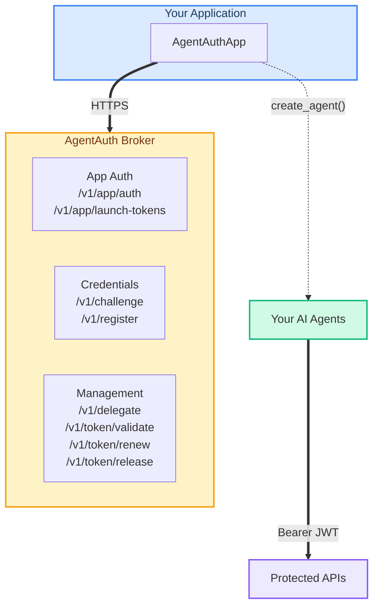

<p align="center">
  
</p>

<h1 align="center">AgentAuth Python SDK</h1>

<p align="center">
  <a href="LICENSE"></a>
  <a href="https://www.python.org/downloads/"></a>
  <a href="https://mypy-lang.org/"></a>
</p>

<p align="center">
  Ephemeral, task-scoped credentials for AI agents.<br>
  Built on Ed25519 challenge-response and the <a href="https://github.com/devonartis/AI-Security-Blueprints/blob/main/patterns/ephemeral-agent-credentialing/versions/v1.3.md">Ephemeral Agent Credentialing v1.3</a> pattern.
</p>

---

## Why AgentAuth?

AI agents need credentials to access databases, APIs, and file systems. Most teams give agents shared API keys or inherit user permissions — both create over-privileged, long-lived, unauditable access. AgentAuth takes a different approach:

- **Ephemeral identities** — every agent gets a unique Ed25519 keypair, generated in memory and never persisted to disk
- **Task-scoped tokens** — credentials are limited to exactly what the agent needs (`read:data:customers`, not `read:*:*`)
- **Short-lived by default** — tokens expire in minutes, not hours or days
- **Delegation chains** — agents can delegate narrower permissions to other agents, enforced at every hop

This SDK is the Python client for the [AgentAuth broker](https://github.com/devonartis/agentauth). The broker is the credential authority; this SDK makes it easy to integrate from Python.

## Installation

```bash
uv add agentauth
```

Or with pip:

```bash
pip install agentauth
```

**Requirements:** Python 3.10+ and a running [AgentAuth broker](https://github.com/devonartis/agentauth) instance.

## Quick Start

```python
import os
from agentauth import AgentAuthApp, validate

# Connect to the broker (lazy — no auth until first create_agent)
app = AgentAuthApp(
    broker_url=os.environ["AGENTAUTH_BROKER_URL"],
    client_id=os.environ["AGENTAUTH_CLIENT_ID"],
    client_secret=os.environ["AGENTAUTH_CLIENT_SECRET"],
)

# Create an agent with specific scope
agent = app.create_agent(
    orch_id="my-service",
    task_id="read-customer-data",
    requested_scope=["read:data:customers"],
)

# Use the token as a Bearer credential
import httpx
resp = httpx.get(
    "https://your-api/data/customers",
    headers=agent.bearer_header,
)

# Validate the token (any service can do this)
result = validate(app.broker_url, agent.access_token)
print(result.claims.scope)  # ['read:data:customers']

# Release when done — token is dead immediately
agent.release()
```

## Agent Lifecycle

```python
# Create — agent gets a SPIFFE identity and scoped JWT
agent = app.create_agent(orch_id="svc", task_id="task", requested_scope=["read:data:x"])

# Use — agent.access_token is a standard Bearer JWT
print(agent.agent_id)      # spiffe://agentauth.local/agent/svc/task/a1b2c3d4
print(agent.scope)         # ['read:data:x']
print(agent.expires_in)    # 300 (seconds)

# Renew — new token, same identity, old token revoked
agent.renew()

# Delegate — give narrower scope to another agent
delegated = agent.delegate(delegate_to=other.agent_id, scope=["read:data:x"])

# Release — self-revoke, idempotent
agent.release()
```

## MedAssist AI Demo

The [`demo/`](demo/) directory contains **MedAssist AI** — an interactive healthcare demo that showcases every AgentAuth capability against a live broker.

**What it does:** A FastAPI web app where you enter a patient ID and a plain-language request. A local LLM (OpenAI-compatible) chooses which tools to call. The app dynamically creates broker agents with only the scopes those tools need, for that specific patient. You see scope enforcement, cross-patient denial, delegation, token renewal, and release — all in a real-time execution trace.

**What it demonstrates:**

| Capability | How the demo shows it |
|------------|----------------------|
| **Dynamic agent creation** | Agents spawn on demand as the LLM selects tools — clinical, billing, prescription |
| **Per-patient scope isolation** | Each agent's scopes are parameterized to one patient ID |
| **Cross-patient denial** | LLM asks for another patient's records → `scope_denied` in the trace |
| **Delegation** | Clinical agent delegates `write:prescriptions:{patient}` to the prescription agent |
| **Token lifecycle** | Renewal and release shown at end of each encounter |
| **Audit trail** | Dedicated audit tab showing hash-chained broker events |

### Running the demo

```bash
# 1. Start the AgentAuth broker
cd broker && ./scripts/stack_up.sh && cd ..

# 2. Register the demo app with the broker (one-time setup)
export AGENTAUTH_ADMIN_SECRET="your-admin-secret"
uv run python demo/setup.py
# → Prints client_id and client_secret

# 3. Configure demo/.env (copy from demo/.env.example)
cp demo/.env.example demo/.env
# Fill in: broker URL, client_id, client_secret, LLM endpoint

# 4. Run it
uv run uvicorn demo.app:app --reload --port 5000
# Open http://127.0.0.1:5000
```

For architecture diagrams, step-by-step traces, and a live presentation script, see [`demo/BEGINNERS_GUIDE.md`](demo/BEGINNERS_GUIDE.md) and [`demo/PRESENTERS_GUIDE.md`](demo/PRESENTERS_GUIDE.md).

## Scope Format

Scopes are three segments: `action:resource:identifier`

```
read:data:customers          — read customer data
write:data:order-abc-123     — write to a specific order
read:data:*                  — wildcard: read ANY data resource
```

Wildcard `*` only works in the identifier (third) position. Action and resource must match exactly.

```python
from agentauth import scope_is_subset

scope_is_subset(["read:data:customers"], ["read:data:*"])     # True
scope_is_subset(["write:data:customers"], ["read:data:*"])    # False (write != read)
scope_is_subset(["read:logs:customers"], ["read:data:*"])     # False (logs != data)
```

## Delegation

Agents delegate narrower scope to other agents. Authority can only narrow, never widen.

```python
# A has broad scope
agent_a = app.create_agent(
    orch_id="pipeline", task_id="orchestrator",
    requested_scope=["read:data:partition-7", "read:data:partition-8"],
)

# A delegates ONLY partition-7 to B
delegated = agent_a.delegate(
    delegate_to=agent_b.agent_id,
    scope=["read:data:partition-7"],
)

# Validate: delegated token has only partition-7
result = validate(broker_url, delegated.access_token)
print(result.claims.scope)  # ['read:data:partition-7']
```

## Error Handling

```python
from agentauth.errors import AuthorizationError, TransportError

try:
    agent = app.create_agent(orch_id="svc", task_id="t", requested_scope=scope)
except AuthorizationError as e:
    print(e.status_code)        # 403
    print(e.problem.detail)     # "scope exceeds app ceiling"
    print(e.problem.error_code) # "scope_violation"
except TransportError:
    print("Broker unreachable")
```

## Architecture



## Authority Chain

```
Operator (root of trust)
  │  registers app, sets scope ceiling
  ▼
Application (your code — AgentAuthApp)
  │  creates agents within ceiling
  ▼
Agent (ephemeral SPIFFE identity + scoped JWT)
  │  scope can only narrow on delegation
  ▼
Delegated Agent (sub-agent, max 5 hops)
```

## Documentation

| Guide | Description |
|-------|-------------|
| [Concepts](docs/concepts.md) | Roles, scopes, delegation, trust model, and standards |
| [Getting Started](docs/getting-started.md) | Install, connect, and create your first agent |
| [Developer Guide](docs/developer-guide.md) | Delegation patterns, scope gating, error handling |
| [API Reference](docs/api-reference.md) | Every class, method, parameter, and exception |
| [Testing Guide](docs/testing-guide.md) | Unit tests, integration tests, running the test suite |

For broker setup and administration, see the [AgentAuth broker documentation](https://github.com/devonartis/agentauth/tree/main/docs).

## Standards Alignment

| Standard | What it addresses |
|----------|-------------------|
| **NIST IR 8596** | Unique AI agent identities via SPIFFE IDs |
| **NIST SP 800-207** | Zero-trust per-request validation |
| **OWASP Top 10 for Agentic AI (2026)** | ASI03 (Identity/Privilege Abuse), ASI07 (Insecure Inter-Agent Communication) |
| **IETF WIMSE** | Delegation chain re-binding |
| **IETF draft-klrc-aiagent-auth-00** | OAuth/WIMSE/SPIFFE framework for AI agents |

## Contributing

```bash
git clone https://github.com/devonartis/agentauth-python.git
cd agentauth-python
uv sync

# Run checks
uv run ruff check .                    # lint
uv run mypy --strict src/              # type check
uv run pytest tests/unit/              # unit tests (no broker)
```

## License

This SDK is licensed under the [MIT License](LICENSE).

The [AgentAuth broker](https://github.com/devonartis/agentauth) is licensed separately under AGPL-3.0. See the broker repo for details.
