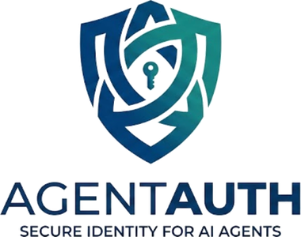
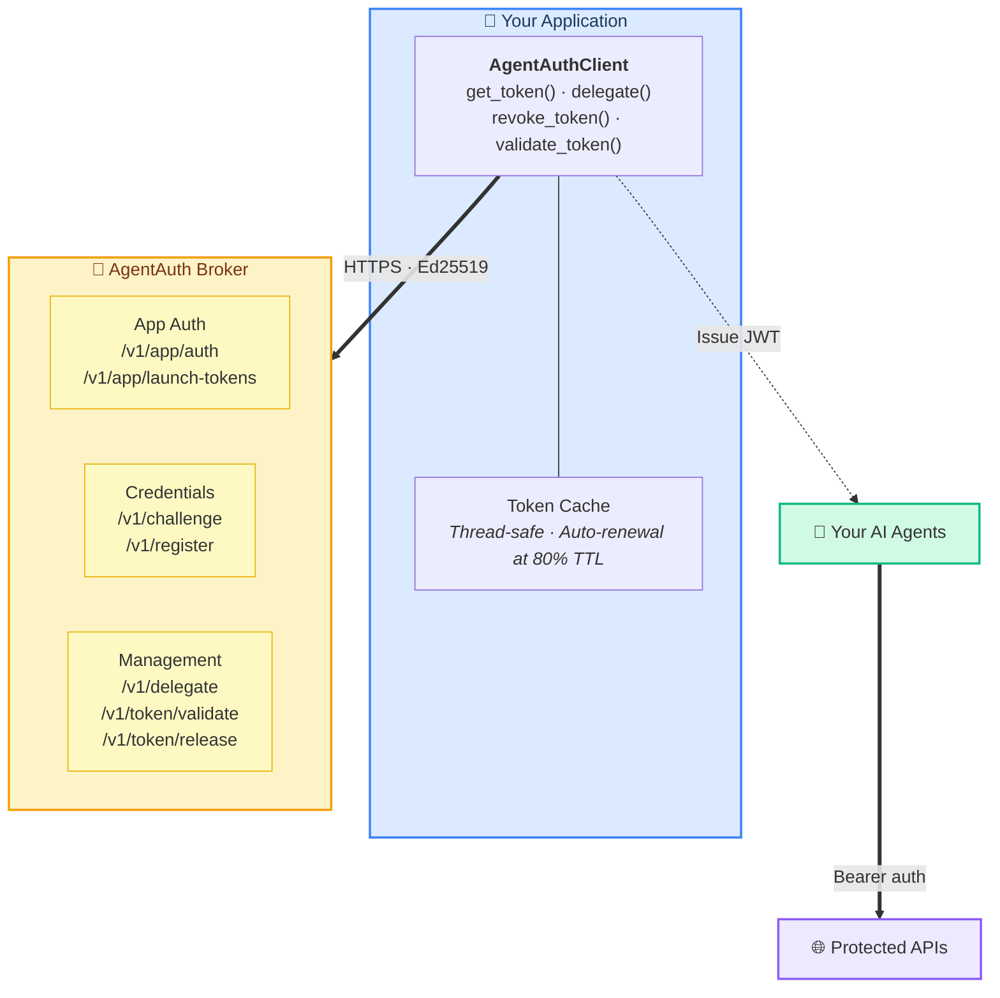
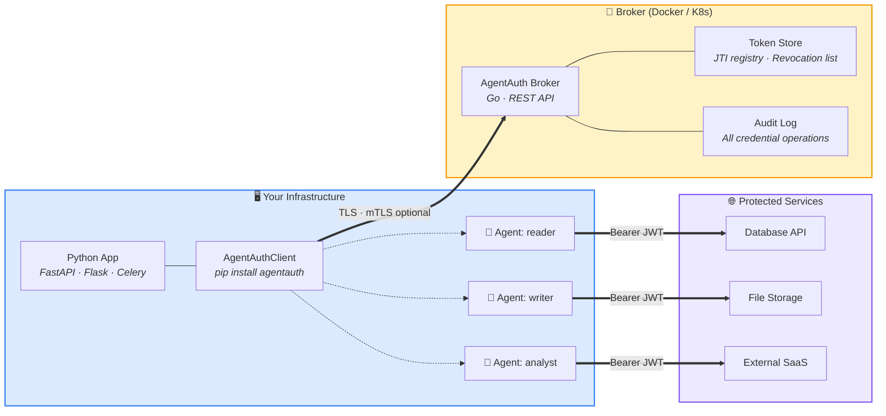
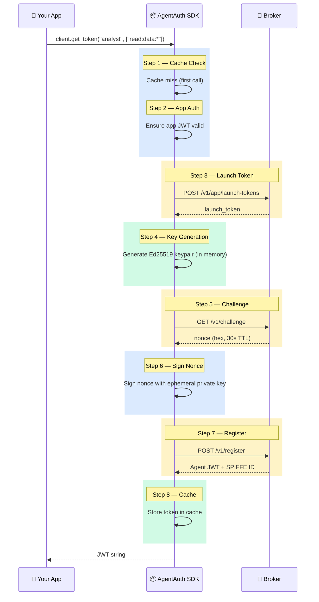
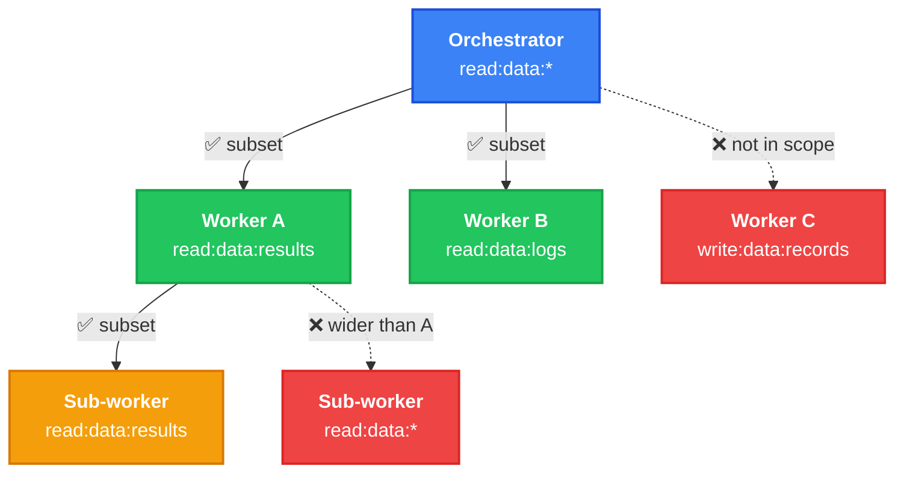
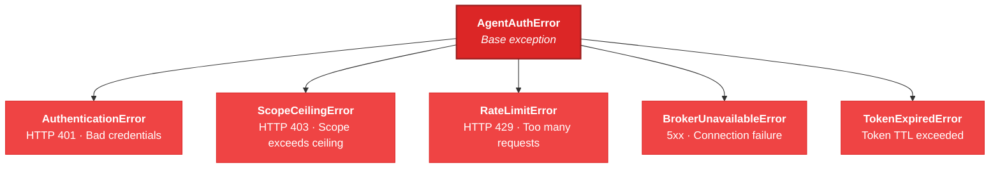

<p align="center">
  
</p>

<h1 align="center">AgentAuth Python SDK</h1>

<p align="center">
  <a href="https://opensource.org/licenses/MIT"></a>
  <a href="https://www.python.org/downloads/"></a>
  <a href="https://github.com/devonartis/agentauth-python-sdk/actions"></a>
  <a href="https://mypy-lang.org/"></a>
</p>

<p align="center">
  Ephemeral, task-scoped credentials for AI agents.<br>
  Built on Ed25519 challenge-response and the <a href="https://github.com/devonartis/AI-Security-Blueprints/blob/main/patterns/ephemeral-agent-credentialing/versions/v1.2.md">Ephemeral Agent Credentialing</a> pattern.
</p>

---

## Why AgentAuth?

AI agents need credentials to access databases, APIs, and file systems. Most teams give agents shared API keys or inherit user permissions — both create over-privileged, long-lived, unauditable access. AgentAuth takes a different approach:

- **Ephemeral identities** — every agent instance gets a unique Ed25519 keypair, generated in memory and never persisted to disk
- **Task-scoped tokens** — credentials are limited to exactly what the agent needs (`read:data:customers`, not `read:*:*`)
- **Short-lived by default** — tokens expire in minutes, not hours or days
- **Delegation chains** — agents can delegate narrower permissions to other agents, with scope attenuation enforced at every hop

The SDK wraps the [AgentAuth broker](https://github.com/devonartis/agentAuth) API into simple Python calls. What takes 40+ lines of manual Ed25519 key management, nonce signing, and token caching becomes three lines:

```python
from agentauth import AgentAuthClient

client = AgentAuthClient(broker_url, client_id, client_secret)
token = client.get_token("data-analyst", ["read:data:customers"])
```

## Installation

```bash
uv add git+https://github.com/devonartis/agentauth-python-sdk
```

Or with pip:

```bash
pip install git+https://github.com/devonartis/agentauth-python-sdk
```

**Requirements:** Python 3.10+ and a running [AgentAuth broker](https://github.com/devonartis/agentAuth) instance.

## Quick Start

```python
import os
from agentauth import AgentAuthClient

# 1. Connect — authenticates your app with the broker on creation
client = AgentAuthClient(
    broker_url=os.environ["AGENTAUTH_BROKER_URL"],
    client_id=os.environ["AGENTAUTH_CLIENT_ID"],
    client_secret=os.environ["AGENTAUTH_CLIENT_SECRET"],
)

# 2. Get a scoped credential for an agent
token = client.get_token("data-analyst", scope=["read:data:*"])

# 3. Use the token as a standard Bearer credential
import requests
resp = requests.get(
    "https://your-api/data/customers",
    headers={"Authorization": f"Bearer {token}"},
)

# 4. Delegate a narrower scope to another agent
delegated = client.delegate(
    token, to_agent_id="spiffe://agentauth/agent/summarizer",
    scope=["read:data:reports"], ttl=120,
)

# 5. Validate and revoke
result = client.validate_token(token)  # {"valid": True, "claims": {...}}
client.revoke_token(token)             # Immediate invalidation
```

## Architecture



## Deployment Topology



## The Credential Flow

Every call to `get_token()` executes an 8-step protocol internally:



## Delegation Chain

Agents can delegate narrower permissions to other agents:



> Scope can only **narrow** at each hop. Revoking the orchestrator's token invalidates all downstream delegations.

## Error Hierarchy



## Security Properties

| Property | Implementation |
|----------|----------------|
| **Ephemeral keys** | Ed25519 keypairs generated in memory per `get_token()` call. Private keys never touch disk. |
| **Task-scoped tokens** | `action:resource:identifier` scope format enforced by the broker. |
| **Short TTLs** | Default 5-minute token lifetime. Stolen tokens expire quickly. |
| **Scope attenuation** | Delegation can only narrow permissions. Enforced at every hop in the chain. |
| **Thread safety** | Token cache and app auth state protected by `threading.Lock`. |
| **TLS by default** | Certificate verification enabled. No silent `verify=False`. |
| **No secret leakage** | `client_secret` never appears in error messages, `repr()`, or logs. |

## Standards Alignment

The SDK implements the [Ephemeral Agent Credentialing](https://github.com/devonartis/AI-Security-Blueprints/blob/main/patterns/ephemeral-agent-credentialing/versions/v1.2.md) pattern (v1.2), which aligns with:

- **NIST IR 8596** — Unique AI agent identities via SPIFFE IDs
- **NIST SP 800-207** — Zero-trust per-request validation
- **OWASP Top 10 for Agentic AI (2026)** — ASI03 (Identity/Privilege Abuse), ASI07 (Insecure Inter-Agent Communication)
- **IETF WIMSE** (draft-ietf-wimse-arch-06) — Delegation chain re-binding
- **IETF draft-klrc-aiagent-auth-00** — OAuth/WIMSE/SPIFFE framework for AI agents

## Documentation

| Guide | Description |
|-------|-------------|
| [Concepts](docs/concepts.md) | Architecture, security model, scopes, and delegation |
| [Getting Started](docs/getting-started.md) | Install, connect, and issue your first credential in 5 minutes |
| [Developer Guide](docs/developer-guide.md) | Multi-agent delegation, error handling, and framework integration |
| [API Reference](docs/api-reference.md) | Complete method signatures, exception hierarchy, and behavior reference |

For broker setup and administration, see the [AgentAuth broker documentation](https://github.com/devonartis/agentAuth/tree/develop/docs).

## Contributing

Contributions are welcome. Please open an issue to discuss proposed changes before submitting a pull request.

```bash
# Development setup
git clone https://github.com/devonartis/agentauth-python-sdk
cd agentauth-python-sdk
uv sync

# Run the full check suite
uv run mypy src/agentauth/       # Type checking (strict mode)
uv run ruff check src/ tests/    # Linting
uv run pytest tests/unit/        # Unit tests (no broker required)
```

## License

[MIT](LICENSE)
