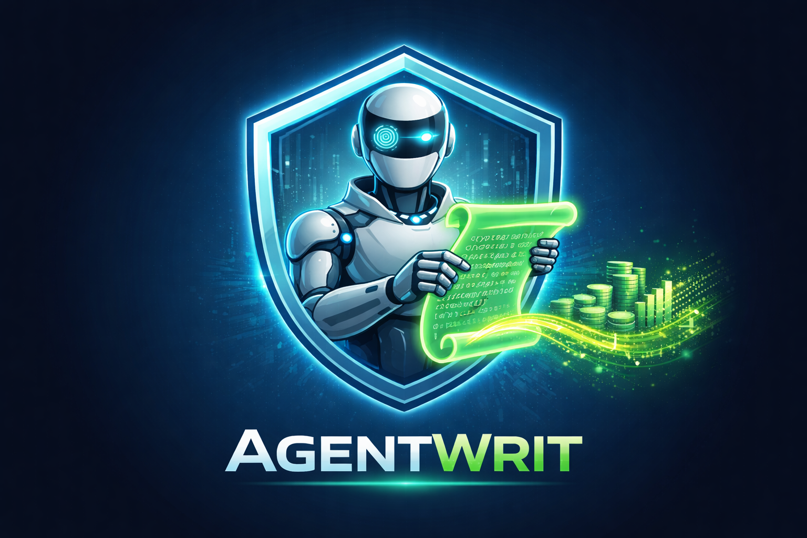

<p align="center">
  
</p>

<h1 align="center">AgentWrit Python SDK</h1>

<p align="center">
  <a href="LICENSE"></a>
  <a href="https://www.python.org/downloads/"></a>
  <a href="https://mypy-lang.org/"></a>
</p>

<p align="center">
  Ephemeral, task-scoped credentials for AI agents.<br>
  Built on Ed25519 challenge-response and the <a href="https://github.com/devonartis/AI-Security-Blueprints/blob/main/patterns/ephemeral-agent-credentialing/versions/v1.3.md">Ephemeral Agent Credentialing v1.3</a> pattern.
</p>

<p align="center">
  <a href="#why-agentwrit">Why</a> ·
  <a href="#installation">Install</a> ·
  <a href="#prerequisites">Prerequisites</a> ·
  <a href="#quick-start">Quick Start</a> ·
  <a href="#agent-lifecycle">Lifecycle</a> ·
  <a href="#medassist-ai-demo">Demo</a> ·
  <a href="#scope-format">Scopes</a> ·
  <a href="#delegation">Delegation</a> ·
  <a href="#error-handling">Errors</a> ·
  <a href="#architecture">Architecture</a> ·
  <a href="#documentation">Docs</a>
</p>

---

## Why AgentWrit?

AI agents need credentials to access databases, APIs, and file systems. Most teams give agents shared API keys or inherit user permissions — both create over-privileged, long-lived, unauditable access. AgentWrit takes a different approach:

- **Ephemeral identities** — every agent gets a unique Ed25519 keypair, generated in memory and never persisted to disk
- **Task-scoped tokens** — credentials are limited to exactly what the agent needs (`read:data:customers`, not `read:*:*`)
- **Short-lived by default** — tokens expire in minutes, not hours or days
- **Delegation chains** — agents can delegate a subset of their permissions to other agents; the broker rejects any attempt to widen

This SDK is the Python client for the [AgentWrit broker](https://github.com/devonartis/agentwrit) — the broker is the credential authority, and this SDK is how your Python code talks to it.

## Installation

Install from GitHub (not yet on PyPI):

```bash
uv add git+https://github.com/devonartis/agentwrit-python.git
```

Or with pip:

```bash
pip install git+https://github.com/devonartis/agentwrit-python.git
```

For local development:

```bash
git clone https://github.com/devonartis/agentwrit-python.git
cd agentwrit-python
uv sync --all-extras
```

**Requirements:** Python 3.10+. The SDK also needs a broker and credentials — see [Prerequisites](#prerequisites).

## Prerequisites

The SDK is a client. It does **not** run the broker, and it does **not** mint its own credentials. Before any code in [Quick Start](#quick-start) will work, you need three things:

**1. A reachable AgentWrit broker.**
The broker is a separate service that issues and validates tokens.

- *Have a platform team running one?* Ask them for the broker URL.
- *Running it yourself?* Stand one up locally — the [broker repo](https://github.com/devonartis/agentwrit) ships a `docker compose` setup. From this repo:
  ```bash
  docker compose up -d   # pulls devonartis/agentwrit from Docker Hub
  ```

**2. App credentials (`client_id` + `client_secret`).**
These are issued by the **broker operator/admin** when they register your app and set its scope ceiling. The SDK cannot create them for you.

- *Have a broker admin?* Ask them to register your app and send you the `client_id` and `client_secret`.
- *You are the admin?* Use the included setup script (it registers an app and prints both values):
  ```bash
  export AGENTWRIT_ADMIN_SECRET="<your-broker-admin-secret>"
  uv run python demo/setup.py
  ```

**3. Environment variables set** on the process that uses the SDK:
```bash
export AGENTWRIT_BROKER_URL="http://localhost:8080"   # from step 1
export AGENTWRIT_CLIENT_ID="<from step 2>"
export AGENTWRIT_CLIENT_SECRET="<from step 2>"
```

> Auth is lazy — the SDK doesn't talk to the broker until your first `create_agent()` call. If that call raises `AuthenticationError`, your `client_id` or `client_secret` is wrong (or the operator rotated them). If it raises `TransportError`, the broker URL is unreachable.

## Quick Start

> Assumes [Prerequisites](#prerequisites) are met — broker reachable, app registered, env vars set.

```python
import os
from agentwrit import AgentWritApp, validate

# Connect to the broker (lazy — no auth until first create_agent)
app = AgentWritApp(
    broker_url=os.environ["AGENTWRIT_BROKER_URL"],
    client_id=os.environ["AGENTWRIT_CLIENT_ID"],          # from broker admin
    client_secret=os.environ["AGENTWRIT_CLIENT_SECRET"],  # from broker admin
)

# Create an agent with specific scope
agent = app.create_agent(
    orch_id="my-service",
    task_id="read-customer-data",
    requested_scope=["read:data:customers"],
)

# Use the token as a Bearer credential
import httpx
resp = httpx.get(
    "https://your-api/data/customers",
    headers=agent.bearer_header,
)

# Validate the token (any service can do this)
result = validate(app.broker_url, agent.access_token)
print(result.claims.scope)  # ['read:data:customers']

# Release when done — token is dead immediately
agent.release()
```

## Agent Lifecycle

```python
# Create — agent gets a SPIFFE identity and scoped JWT
agent = app.create_agent(orch_id="svc", task_id="task", requested_scope=["read:data:x"])

# Use — agent.access_token is a standard Bearer JWT
print(agent.agent_id)      # spiffe://agentwrit.local/agent/svc/task/a1b2c3d4
print(agent.scope)         # ['read:data:x']
print(agent.expires_in)    # 300 (seconds)

# Renew — new token, same identity, old token revoked
agent.renew()

# Delegate — pass a subset of scope to another agent (equal or narrower)
delegated = agent.delegate(delegate_to=other.agent_id, scope=["read:data:x"])

# Release — self-revoke, idempotent
agent.release()
```

## MedAssist AI Demo

The [`demo/`](demo/) directory contains **MedAssist AI** — an interactive healthcare demo that showcases every AgentWrit capability against a live broker.

**What it does:** A FastAPI web app where you enter a patient ID and a plain-language request. A local LLM (OpenAI-compatible) chooses which tools to call, and the app dynamically creates broker agents with only the scopes those tools need for that specific patient. Every step — scope enforcement, cross-patient denial, delegation, token renewal, release — appears in a real-time execution trace.

**What it demonstrates:**

| Capability | How the demo shows it |
|------------|----------------------|
| **Dynamic agent creation** | Agents spawn on demand as the LLM selects tools — clinical, billing, prescription |
| **Per-patient scope isolation** | Each agent's scopes are parameterized to one patient ID |
| **Cross-patient denial** | LLM asks for another patient's records → `scope_denied` in the trace |
| **Delegation** | Clinical agent delegates `write:prescriptions:{patient}` to the prescription agent |
| **Token lifecycle** | Renewal and release shown at end of each encounter |
| **Audit trail** | Dedicated audit tab showing hash-chained broker events |

### Running with Docker (recommended)

```bash
AGENTWRIT_ADMIN_SECRET="your-secret" \
LLM_API_KEY="your-llm-key" \
docker compose up -d broker medassist
```

Open [http://localhost:5000](http://localhost:5000). The demo auto-registers with the broker on startup — no manual setup needed. You only need an OpenAI-compatible LLM endpoint (set `LLM_BASE_URL` and `LLM_MODEL` if not using OpenAI).

### Running from source

```bash
# 1. Start the broker
docker compose up -d broker

# 2. Register the demo app (one-time)
export AGENTWRIT_ADMIN_SECRET="your-admin-secret"
uv run python demo/setup.py

# 3. Configure demo/.env (copy from demo/.env.example)
cp demo/.env.example demo/.env

# 4. Run it
uv run uvicorn demo.app:app --reload --port 5000
```

For architecture diagrams and a live presentation script, see [`demo/BEGINNERS_GUIDE.md`](demo/BEGINNERS_GUIDE.md) and [`demo/PRESENTERS_GUIDE.md`](demo/PRESENTERS_GUIDE.md).

## Support Ticket Demo

The [`demo2/`](demo2/) directory contains **AgentWrit Live** — a support ticket pipeline where three LLM-driven agents (triage, knowledge, response) process customer requests under zero-trust scoped credentials.

```bash
AGENTWRIT_ADMIN_SECRET="your-secret" \
LLM_API_KEY="your-llm-key" \
docker compose up -d broker support-tickets
```

Open [http://localhost:5001](http://localhost:5001).

| Capability | How the demo shows it |
|------------|----------------------|
| **Identity-gated pipeline** | Anonymous tickets halt at triage — no customer-scoped agents spawn |
| **Per-customer scope isolation** | Each agent is scoped to the verified customer only |
| **Cross-customer denial** | Asking about another customer's data → scope denied |
| **Tool-level enforcement** | `delete_account` and `send_external_email` blocked by scope |
| **Natural token expiry** | 5-second TTL credential expires on its own |

## Scope Format

Scopes are three segments: `action:resource:identifier`

```
read:data:customers          — read customer data
write:data:order-abc-123     — write to a specific order
read:data:*                  — wildcard: read ANY data resource
```

Wildcard `*` only works in the identifier (third) position. Action and resource must match exactly.

```python
from agentwrit import scope_is_subset

scope_is_subset(["read:data:customers"], ["read:data:*"])     # True
scope_is_subset(["write:data:customers"], ["read:data:*"])    # False (write != read)
scope_is_subset(["read:logs:customers"], ["read:data:*"])     # False (logs != data)
```

## Delegation

Agents delegate a subset of their scope to other agents. Delegation cannot widen authority — equal or narrower scope is accepted; any scope the delegator doesn't hold is rejected.

```python
# A has broad scope
agent_a = app.create_agent(
    orch_id="pipeline", task_id="orchestrator",
    requested_scope=["read:data:partition-7", "read:data:partition-8"],
)

# A delegates ONLY partition-7 to B
delegated = agent_a.delegate(
    delegate_to=agent_b.agent_id,
    scope=["read:data:partition-7"],
)

# Validate: delegated token has only partition-7
result = validate(app.broker_url, delegated.access_token)
print(result.claims.scope)  # ['read:data:partition-7']
```

## Error Handling

```python
from agentwrit.errors import AuthorizationError, TransportError

try:
    agent = app.create_agent(orch_id="svc", task_id="t", requested_scope=scope)
except AuthorizationError as e:
    print(e.status_code)        # 403
    print(e.problem.detail)     # "scope exceeds app ceiling"
    print(e.problem.error_code) # "scope_violation"
except TransportError:
    print("Broker unreachable")
```

## Architecture


## Authority Chain

```
Operator (root of trust)
  │  registers app, sets scope ceiling
  ▼
Application (your code — AgentWritApp)
  │  creates agents within ceiling
  ▼
Agent (ephemeral SPIFFE identity + scoped JWT)
  │  delegation cannot widen scope (equal or narrower allowed)
  ▼
Delegated Agent (sub-agent, max 5 hops)
```

## Documentation

| Guide | Description |
|-------|-------------|
| [Concepts](docs/concepts.md) | Roles, scopes, delegation, trust model, and standards |
| [Getting Started](docs/getting-started.md) | Install, connect, and create your first agent |
| [Developer Guide](docs/developer-guide.md) | Delegation patterns, scope gating, error handling |
| [API Reference](docs/api-reference.md) | Every class, method, parameter, and exception |
| [Testing Guide](docs/testing-guide.md) | Unit tests, integration tests, running the test suite |

For broker setup and administration, see the [AgentWrit broker documentation](https://github.com/devonartis/agentwrit/tree/main/docs).

## Standards Alignment

| Standard | What it addresses |
|----------|-------------------|
| **NIST IR 8596** | Unique AI agent identities via SPIFFE IDs |
| **NIST SP 800-207** | Zero-trust per-request validation |
| **OWASP Top 10 for Agentic AI (2026)** | ASI03 (Identity/Privilege Abuse), ASI07 (Insecure Inter-Agent Communication) |
| **IETF WIMSE** | Delegation chain re-binding |
| **IETF draft-klrc-aiagent-auth-00** | OAuth/WIMSE/SPIFFE framework for AI agents |

## Contributing

See **[CONTRIBUTING.md](CONTRIBUTING.md)** for the full workflow: `uv` setup, **live-broker** verification (clone [agentwrit](https://github.com/devonartis/agentwrit) or use your own broker), and **evidence to include in PRs** so maintainers can review broker-facing changes confidently.

Quick local checks (no broker required for unit tests):

```bash
git clone https://github.com/devonartis/agentwrit-python.git
cd agentwrit-python
uv sync --all-extras

uv run ruff check .
uv run mypy --strict src/
uv run pytest tests/unit/
```

## License

This SDK is licensed under the [MIT License](LICENSE).

The [AgentWrit broker](https://github.com/devonartis/agentwrit) is licensed separately under PolyForm Internal Use 1.0.0. See the broker repo for details.
