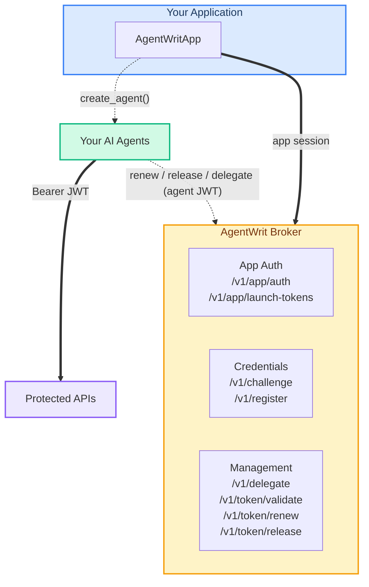

<p align="center">
  
</p>

<h1 align="center">AgentWrit Python SDK</h1>

<p align="center">
  <a href="https://pypi.org/project/agentwrit/"></a>
  <a href="https://pypi.org/project/agentwrit/"></a>
  <a href="https://github.com/devonartis/agentwrit-python/actions/workflows/ci.yml"></a>
  <a href="LICENSE"></a>
  <a href="https://www.python.org/downloads/"></a>
  <a href="https://mypy-lang.org/"></a>
</p>

<p align="center">
  The Python client for the <a href="https://github.com/devonartis/agentwrit">AgentWrit broker</a> — ephemeral, task-scoped credentials for AI agents.
</p>

<p align="center">
  <a href="#-install">Install</a> ·
  <a href="#-quick-start">Quick start</a> ·
  <a href="#-core-ideas">Core ideas</a> ·
  <a href="#-demos">Demos</a> ·
  <a href="#-documentation">Docs</a>
</p>

---

## 💡 Why you'd reach for this

Hand an AI agent a long-lived API key and a compromised agent becomes a compromised tenant — no expiry, no blast-radius, no audit. The AgentWrit broker issues short-lived JWTs scoped to one task per token instead. This SDK is the Python client: it registers agents, delegates scope, validates tokens, and cleans up when the task ends.

In five SDK lines:

```python
app = AgentWritApp(broker_url, client_id, client_secret)
agent = app.create_agent("my-service", "task-1", ["read:data:customer-7291"])
httpx.get("https://api/customers/7291", headers=agent.bearer_header)
validate(app.broker_url, agent.access_token)   # any service can verify
agent.release()                                  # token dies at the broker
```

---

## 📦 Install

```bash
uv add agentwrit           # or: pip install agentwrit
```

Requires **Python 3.10+**. The SDK pulls in `httpx` and `cryptography` automatically.

> ⚠️ **The SDK is synchronous.** v0.3.0 uses `httpx`'s sync client. On FastAPI, Starlette, or Sanic, wrap SDK calls in `asyncio.to_thread(...)` so they don't block the event loop — see the [Developer Guide](docs/developer-guide.md#async--await-support).

---

## ⚡ Quick start

> **Prerequisites.** The SDK is a client. You need a reachable broker, app credentials (`client_id` + `client_secret` from the broker operator), and three env vars set. If you're starting from zero, [Getting Started](docs/getting-started.md) walks you through all three in about five minutes.

```python
import os
import httpx
from agentwrit import AgentWritApp, validate

app = AgentWritApp(
    broker_url=os.environ["AGENTWRIT_BROKER_URL"],
    client_id=os.environ["AGENTWRIT_CLIENT_ID"],
    client_secret=os.environ["AGENTWRIT_CLIENT_SECRET"],
)

agent = app.create_agent(
    orch_id="my-service",
    task_id="read-customer-data",
    requested_scope=["read:data:customer-7291"],
)

# Use the JWT as a Bearer credential anywhere
resp = httpx.get("https://your-api/data/customers", headers=agent.bearer_header)

# Any service can verify a token — no AgentWritApp needed, just the broker URL
result = validate(app.broker_url, agent.access_token)
print(result.claims.scope)   # ['read:data:customer-7291']

# Release the moment the task is done
agent.release()
```

One agent, one scope, one token used, one token killed.

---

## 🧠 Core ideas

Everything else in the SDK builds on these five.

### Ephemeral identities

Each agent gets a unique Ed25519 keypair (generated in-memory by default — pass `private_key=` if you need a custom source) and a SPIFFE ID like `spiffe://agentwrit.local/agent/my-service/task-001/a1b2c3d4`. The ID is preserved across `renew()`, discarded after `release()`.

### Three-segment scopes

Scopes are `action:resource:identifier`. Wildcards only live in the identifier slot.

```
read:data:customer-7291      ✓ specific
read:data:*                  ✓ any identifier
read:*:customers             ✗ wildcard in resource — rejected
*:data:customers             ✗ wildcard in action — rejected
```

Use `scope_is_subset(required, held)` to gate every action in your app.

### Delegation only narrows

`agent.delegate()` accepts equal or narrower scope and refuses to widen. Max chain depth is 5. If a delegator tries to hand over authority it doesn't hold, the broker returns `403 scope_violation`.

### Trust the token, not the object

`agent.scope` reflects what you *requested* — useful for gating inside your own process, but client-side. The authoritative, cryptographically signed scope lives in the JWT claims and surfaces via `validate(broker_url, token).claims.scope`. Never make a security decision off `agent.scope` alone.

### Revocable at four levels

One token, one agent, one task, or an entire delegation chain — killed on demand by the operator or the agent itself.

→ Full model, scope gotchas, and trust chain in **[Concepts](docs/concepts.md)**.

---

## 🎬 Demos

Two complete apps ship with the repo. Both have splash pages that frame what you're looking at before you dive into code.

### 🏥 MedAssist — healthcare walkthrough

A FastAPI clinical assistant. You ask a plain-language question about a patient; an LLM picks tools (records, labs, billing, prescriptions); the app spawns broker agents on demand, each scoped to *one patient and one category*. Cross-patient questions are denied. Prescription writes flow through a delegation chain.

**[demo/README.md](demo/README.md)** — run instructions, scenario playbook, code map.

### 🎫 Support Tickets — three-agent pipeline

Flask + HTMX + SSE. Three LLM-driven agents (triage → knowledge → response) process customer tickets. Anonymous tickets halt at triage. Dangerous tools (`delete_account`, `send_external_email`) are in the LLM's tool list but not in the agent's scope — so they never execute. One scenario deliberately skips `release()` to watch a 5-second TTL die on its own.

**[demo2/README.md](demo2/README.md)** — run instructions, five scenarios, code map.

---

## ⚠️ Errors

The broker returns RFC 7807 problem details. The SDK parses them into structured exceptions:

```python
from agentwrit.errors import AuthorizationError, TransportError

try:
    agent = app.create_agent(...)
except AuthorizationError as e:
    print(e.status_code)          # 403
    print(e.problem.detail)       # "scope exceeds app ceiling"
    print(e.problem.error_code)   # "scope_violation"
    print(e.problem.request_id)   # matches broker X-Request-ID for log correlation
except TransportError:
    print("Broker unreachable")
```

→ Full hierarchy and every `ProblemDetail` field: **[Developer Guide › Error handling](docs/developer-guide.md#error-handling)**.

---

## 🏗️ Architecture



**Authority narrows at every hop.** Operator sets the app's scope ceiling → app creates agents inside that ceiling → each agent can delegate equal or narrower, up to five hops deep.

---

## 📚 Documentation

| I want to… | Go to |
|-|-|
| Run my first agent in 5 minutes | [Getting Started](docs/getting-started.md) |
| Understand roles, scopes, delegation, trust | [Concepts](docs/concepts.md) |
| Write real code — renewal loops, scope gating, errors | [Developer Guide](docs/developer-guide.md) |
| Look up every class, method, exception | [API Reference](docs/api-reference.md) |
| Run unit, integration, and acceptance tests | [Testing Guide](docs/testing-guide.md) |
| Study eight focused example apps | [Sample Apps](docs/sample-apps/README.md) |

For broker setup, admin APIs, or operator workflows see the **[broker repo](https://github.com/devonartis/agentwrit)** — it's a separate project.

---

## 🤝 Contributing

See **[CONTRIBUTING.md](CONTRIBUTING.md)** for `uv` setup, the live-broker requirement, and the evidence maintainers need before merging broker-facing changes.

```bash
uv sync --all-extras
uv run ruff check .
uv run mypy --strict src/
uv run pytest tests/unit/
```

---

## 📄 License

MIT. See [LICENSE](LICENSE). The [AgentWrit broker](https://github.com/devonartis/agentwrit) is licensed separately under PolyForm Internal Use 1.0.0.
