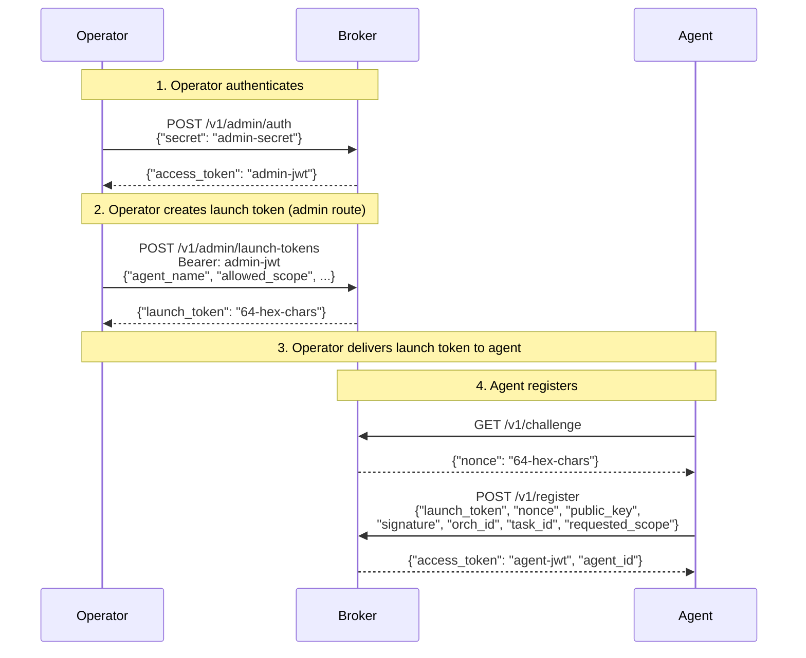
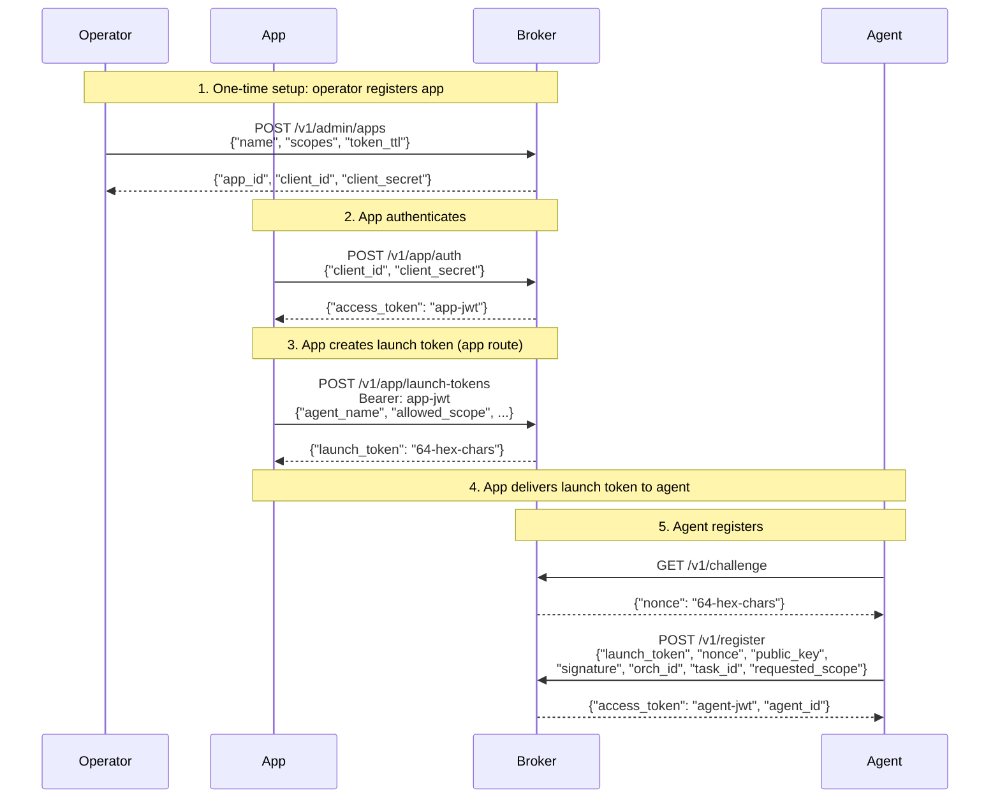
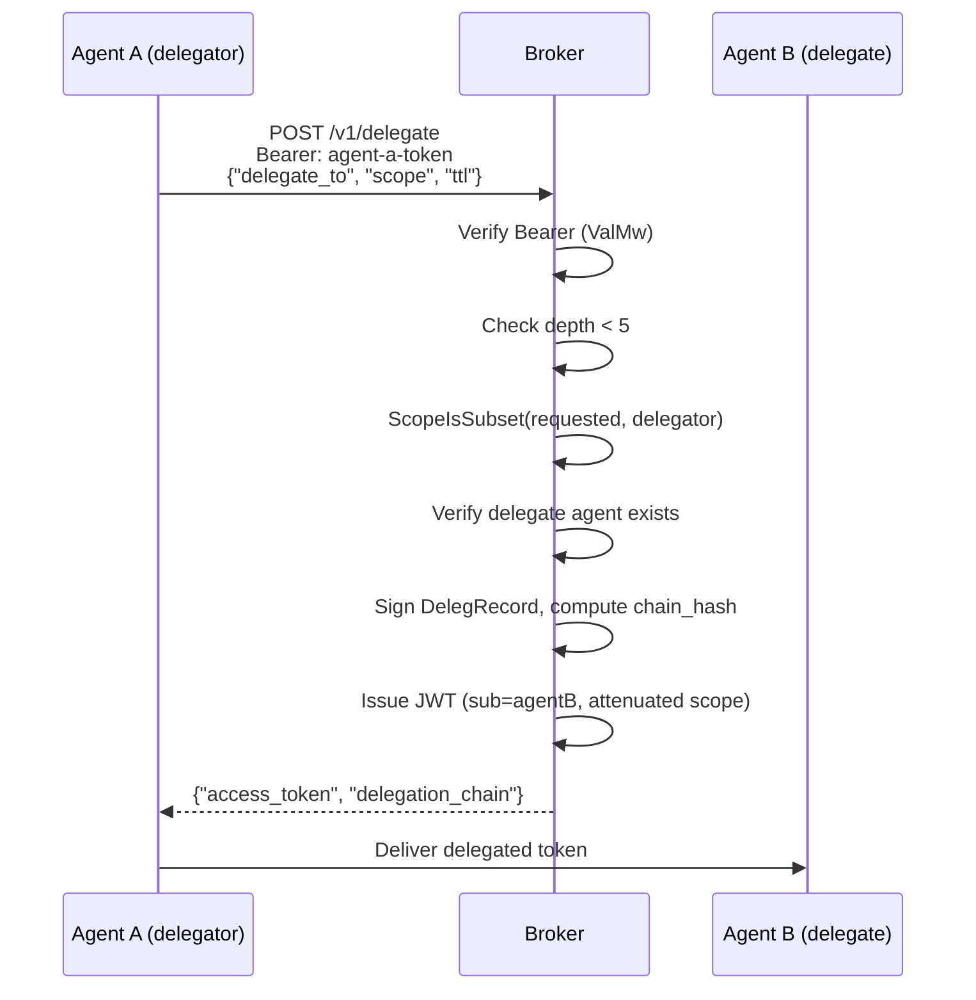

# API Reference

> **Document Version:** 3.0 | **Last Updated:** March 2026 | **Status:** Current
>
> **Audience:** Developers and operators who need the definitive contract for every endpoint.
>
> **Prerequisites:** [Concepts](concepts.md) for background, [Getting Started: Developer](getting-started-developer.md) or [Getting Started: Operator](getting-started-operator.md) for walkthroughs.
>
> **Next steps:** [Troubleshooting](troubleshooting.md) for error resolution | [Common Tasks](common-tasks.md) for step-by-step workflows.

---

## Overview

AgentAuth exposes a JSON HTTP API. All request and response bodies use `Content-Type: application/json`. The broker listens on port 8080 by default (`AA_PORT`).

All error responses use RFC 7807 `application/problem+json` format:

```json
{
  "type": "urn:agentauth:error:{errType}",
  "title": "HTTP Status Text",
  "status": 400,
  "detail": "human-readable description",
  "instance": "/v1/endpoint",
  "error_code": "specific_code",
  "request_id": "hex-id",
  "hint": "optional guidance"
}
```

The `error_code` field is always present. The `hint` field is optional and present on extended error responses.

All responses include an `X-Request-ID` header. If the client sends `X-Request-ID`, it is propagated; otherwise the broker generates one.

All responses include security headers: `X-Content-Type-Options: nosniff`, `Cache-Control: no-store`, and `X-Frame-Options: DENY`. When TLS is enabled (`AA_TLS_MODE=tls` or `mtls`), responses also include `Strict-Transport-Security` (HSTS).

Request bodies are limited to 1 MB on ALL endpoints (enforced by global middleware).

**Error sanitization:** Token validation, renewal, and auth middleware endpoints return generic error messages (e.g., `"token is invalid or expired"`, `"token renewal failed"`, `"token verification failed"`) to prevent leaking internal details to clients.

---

## End-to-End Authentication Flows

Two paths exist for creating launch tokens. Both lead to the same agent registration flow.

### Path A: Operator Bootstrap (platform management)

Used for initial setup, dev/testing, and break-glass scenarios. The operator creates launch tokens directly.



### Path B: App-Driven (production runtime)

Used for normal operations. The app manages its own agents within its scope ceiling.



**Key difference:** The admin route (`/v1/admin/launch-tokens`) has no scope ceiling enforcement — the operator has unrestricted access. The app route (`/v1/app/launch-tokens`) enforces the app's registered scope ceiling — the app can only create launch tokens within the scopes it was registered with. Cross-calling is blocked: app tokens cannot use the admin route and admin tokens cannot use the app route.

---

## Authentication Mechanisms

Three mechanisms are used, depending on the endpoint:

1. **None** -- Public endpoints (health, metrics, challenge, validate, token validate, admin auth)
2. **Bearer token** -- JWT in the `Authorization: Bearer <token>` header. The `ValMw` middleware verifies signature, checks revocation, and injects claims into context.
3. **Launch token** -- Passed in the request body field `launch_token` during agent registration. Not a Bearer token.

Some endpoints require specific scopes in addition to a valid Bearer token. These are noted per-endpoint below.

---

## Broker Endpoints

### Public Endpoints (no auth required)

---

#### GET /v1/challenge

Generate a cryptographic nonce for agent registration.

**Auth:** None

**Response 200:**

| Field | Type | Description |
|---|---|---|
| `nonce` | string | 64-character hex nonce |
| `expires_in` | int | TTL in seconds (always 30) |

```bash
curl http://localhost:8080/v1/challenge
```

```json
{
  "nonce": "a1b2c3d4e5f6...64chars",
  "expires_in": 30
}
```

---

#### GET /v1/health

Broker health check.

**Auth:** None

**Response 200:**

| Field | Type | Description |
|---|---|---|
| `status` | string | Always `"ok"` |
| `version` | string | Broker version (currently `"2.0.0"`) |
| `uptime` | int | Seconds since startup |
| `db_connected` | bool | Whether the SQLite audit database is connected and responsive. `false` if `AA_DB_PATH` is unset or the database is unreachable. |
| `audit_events_count` | int | Total number of audit events in the in-memory log. Useful for verifying persistence — this count should survive broker restarts when `AA_DB_PATH` is configured. |

```bash
curl http://localhost:8080/v1/health
```

```json
{
  "status": "ok",
  "version": "2.0.0",
  "uptime": 42,
  "db_connected": true,
  "audit_events_count": 56
}
```

---

#### GET /v1/metrics

Prometheus metrics endpoint.

**Auth:** None

Returns Prometheus text exposition format. See [Prometheus Metrics](#prometheus-metrics) for the full metric list.

```bash
curl http://localhost:8080/v1/metrics
```

---

#### POST /v1/token/validate

Verify a token and return its claims. Also checks revocation status.

**Auth:** None

**Request body:**

| Field | Type | Required | Description |
|---|---|---|---|
| `token` | string | Yes | JWT string to validate |

**Response 200 (valid):**

```json
{
  "valid": true,
  "claims": {
    "iss": "agentauth",
    "sub": "spiffe://agentauth.local/agent/orch/task/instance",
    "exp": 1707600000,
    "nbf": 1707599700,
    "iat": 1707599700,
    "jti": "a1b2c3d4e5f67890...",
    "scope": ["read:data:*"],
    "task_id": "task-001",
    "orch_id": "my-orchestrator"
  }
}
```

**Response 200 (invalid or revoked):**

```json
{
  "valid": false,
  "error": "token is invalid or expired"
}
```

> **Note:** Error messages are intentionally generic to prevent information leakage. The broker does not distinguish between expired, revoked, malformed, or otherwise invalid tokens in its client-facing error responses.

**Error responses:**

| Status | Type | Condition |
|---|---|---|
| 400 | `invalid_request` | Missing `token` field or malformed JSON |

```bash
curl -X POST http://localhost:8080/v1/token/validate \
  -H "Content-Type: application/json" \
  -d '{"token": "eyJ..."}'
```

---

#### POST /v1/admin/auth

Authenticate as an administrator using the shared secret.

**Auth:** None (rate-limited: 5 req/s, burst 10)

**Request body:**

| Field | Type | Required | Description |
|---|---|---|---|
| `secret` | string | Yes | The plaintext admin secret (compared against the stored bcrypt hash) |

**Response 200:**

| Field | Type | Description |
|---|---|---|
| `access_token` | string | Admin JWT (TTL 300s) |
| `expires_in` | int | Always 300 |
| `token_type` | string | Always `"Bearer"` |

The admin JWT carries scopes: `admin:launch-tokens:*`, `admin:revoke:*`, `admin:audit:*`.

**Error responses:**

| Status | Type | Condition |
|---|---|---|
| 400 | `invalid_request` | Missing `secret` field or malformed JSON |
| 401 | `unauthorized` | Invalid credentials |
| 429 | `rate_limited` | Rate limit exceeded (`Retry-After: 1` header) |

```bash
curl -X POST http://localhost:8080/v1/admin/auth \
  -H "Content-Type: application/json" \
  -d '{"secret": "my-dev-secret"}'
```

```json
{
  "access_token": "eyJ...",
  "expires_in": 300,
  "token_type": "Bearer"
}
```

---

### Agent Endpoints (Bearer token required)

---

#### POST /v1/register

Register an agent via challenge-response. The agent must have obtained a nonce from `GET /v1/challenge` and signed it with its Ed25519 private key.

**Auth:** Launch token (in request body, not Bearer)

**Request body:**

| Field | Type | Required | Description |
|---|---|---|---|
| `launch_token` | string | Yes | 64-char hex launch token from admin |
| `nonce` | string | Yes | Nonce from GET /v1/challenge |
| `public_key` | string | Yes | Base64-encoded Ed25519 public key (32 bytes) |
| `signature` | string | Yes | Base64-encoded Ed25519 signature of nonce bytes |
| `orch_id` | string | Yes | Orchestration identifier |
| `task_id` | string | Yes | Task identifier |
| `requested_scope` | string[] | Yes | Scopes to request (must be subset of launch token's allowed_scope) |

**Response 200:**

| Field | Type | Description |
|---|---|---|
| `agent_id` | string | SPIFFE ID: `spiffe://{domain}/agent/{orch}/{task}/{instance}` |
| `access_token` | string | EdDSA-signed JWT |
| `expires_in` | int | Token TTL in seconds |

**Error responses:**

| Status | Type | Condition |
|---|---|---|
| 400 | `invalid_request` | Malformed JSON or missing required fields |
| 401 | `unauthorized` | Invalid/expired/consumed launch token, invalid nonce, bad signature, bad public key |
| 403 | `scope_violation` | Requested scope exceeds launch token's allowed scope |
| 500 | `internal_error` | Unexpected failure |

```bash
curl -X POST http://localhost:8080/v1/register \
  -H "Content-Type: application/json" \
  -d '{
    "launch_token": "a1b2c3d4...64chars",
    "nonce": "deadbeef...64chars",
    "public_key": "base64EncodedEd25519PubKey==",
    "signature": "base64EncodedSignatureOfNonceBytes==",
    "orch_id": "my-orchestrator",
    "task_id": "task-001",
    "requested_scope": ["read:data:*"]
  }'
```

```json
{
  "agent_id": "spiffe://agentauth.local/agent/my-orchestrator/task-001/a1b2c3d4e5f6",
  "access_token": "eyJ...",
  "expires_in": 300
}
```

---

#### POST /v1/token/renew

Renew an existing token with fresh timestamps and a new JTI. The original token's TTL is preserved — a token issued with 120s TTL renews to 120s, not the broker's DefaultTTL. The MaxTTL ceiling still applies. The predecessor token is revoked before the replacement is issued. Renewal is atomic: the old JTI is invalidated even if issuance subsequently fails. The caller can safely retry.

**Auth:** Bearer token (validated by `ValMw`)

**Request body:** None (token is read from Authorization header)

**Response 200:**

| Field | Type | Description |
|---|---|---|
| `access_token` | string | New JWT with fresh timestamps |
| `expires_in` | int | TTL in seconds |

**Error responses:**

| Status | Type | Condition |
|---|---|---|
| 401 | `unauthorized` | Missing, invalid, expired, or revoked Bearer token. Error detail: `"token renewal failed"` (generic, no internal details leaked). |

```bash
curl -X POST http://localhost:8080/v1/token/renew \
  -H "Authorization: Bearer eyJ..."
```

```json
{
  "access_token": "eyJ...",
  "expires_in": 300
}
```

---

#### POST /v1/delegate

Create a scope-attenuated delegation token for another registered agent.

**Auth:** Bearer token (validated by `ValMw`)



**Request body:**

| Field | Type | Required | Description |
|---|---|---|---|
| `delegate_to` | string | Yes | SPIFFE ID of the delegate agent |
| `scope` | string[] | Yes | Scopes to grant (must be subset of delegator's scope) |
| `ttl` | int | No | TTL in seconds (default 60) |

**Response 200:**

| Field | Type | Description |
|---|---|---|
| `access_token` | string | JWT for the delegate agent |
| `expires_in` | int | TTL in seconds |
| `delegation_chain` | DelegRecord[] | Complete chain including new entry |

Each `DelegRecord`:

| Field | Type | Description |
|---|---|---|
| `agent` | string | SPIFFE ID of the delegating agent |
| `scope` | string[] | Scope held at time of delegation |
| `delegated_at` | string | RFC3339 timestamp |
| `signature` | string | Ed25519 hex signature of the record |

**Error responses:**

| Status | Type | Condition |
|---|---|---|
| 400 | `invalid_request` | Missing `delegate_to` or `scope` |
| 401 | `unauthorized` | Missing or invalid Bearer token |
| 403 | `scope_violation` | Requested scope exceeds delegator's scope, or depth limit (5) exceeded |
| 404 | `not_found` | Delegate agent not registered |
| 500 | `internal_error` | Delegation failed |

```bash
curl -X POST http://localhost:8080/v1/delegate \
  -H "Authorization: Bearer <delegator-token>" \
  -H "Content-Type: application/json" \
  -d '{
    "delegate_to": "spiffe://agentauth.local/agent/orch/task/instance2",
    "scope": ["read:data:*"],
    "ttl": 60
  }'
```

```json
{
  "access_token": "eyJ...",
  "expires_in": 60,
  "delegation_chain": [
    {
      "agent": "spiffe://agentauth.local/agent/orch/task/instance1",
      "scope": ["read:data:*", "write:data:*"],
      "delegated_at": "2026-02-15T12:00:00Z",
      "signature": "a1b2c3..."
    }
  ]
}
```

---

### Admin Endpoints (Bearer + admin scope required)

---

#### POST /v1/admin/launch-tokens

Create a launch token for agent registration.

**Auth:** Bearer token with `admin:launch-tokens:*` scope

**Request body:**

| Field | Type | Required | Default | Description |
|---|---|---|---|---|
| `agent_name` | string | Yes | -- | Name of the agent this token is for |
| `allowed_scope` | string[] | Yes | -- | Scope ceiling for the agent |
| `max_ttl` | int | No | 300 | Maximum token TTL the agent can request |
| `single_use` | bool | No | true | Whether token can only be used once |
| `ttl` | int | No | 30 | Launch token validity period in seconds |

**Response 201:**

| Field | Type | Description |
|---|---|---|
| `launch_token` | string | 64-character hex token |
| `expires_at` | string | RFC3339 expiration timestamp |
| `policy.allowed_scope` | string[] | Scope ceiling bound to this token |
| `policy.max_ttl` | int | TTL ceiling for issued agent tokens |

**Error responses:**

| Status | Type | Condition |
|---|---|---|
| 400 | `invalid_request` | Missing `agent_name` or empty `allowed_scope` |
| 401 | `unauthorized` | Missing or invalid Bearer token |
| 403 | `insufficient_scope` | Token lacks `admin:launch-tokens:*` scope |
| 500 | `internal_error` | Token creation failed |

```bash
curl -X POST http://localhost:8080/v1/admin/launch-tokens \
  -H "Authorization: Bearer <admin-token>" \
  -H "Content-Type: application/json" \
  -d '{
    "agent_name": "my-agent",
    "allowed_scope": ["read:data:*"],
    "max_ttl": 600,
    "single_use": true,
    "ttl": 60
  }'
```

```json
{
  "launch_token": "a1b2c3d4e5f6...64chars",
  "expires_at": "2026-02-15T12:01:00Z",
  "policy": {
    "allowed_scope": ["read:data:*"],
    "max_ttl": 600
  }
}
```

---

#### POST /v1/app/launch-tokens

Create a launch token for an agent. This is the **app/runtime path** — used during normal application operations. The app can only create launch tokens within its registered scope ceiling.

**Auth:** Bearer token with `app:launch-tokens:*` scope (from `POST /v1/app/auth`)

**Request body:** Same as `POST /v1/admin/launch-tokens`.

**Scope ceiling enforcement:** The broker checks that `allowed_scope` is a subset of the app's registered scope ceiling. If any requested scope exceeds the ceiling, the request is rejected with 403.

**Response 201:** Same as `POST /v1/admin/launch-tokens`.

**Error responses:**

| Status | Type | Condition |
|---|---|---|
| 400 | `invalid_request` | Missing `agent_name` or empty `allowed_scope` |
| 401 | `unauthorized` | Missing or invalid Bearer token |
| 403 | `insufficient_scope` | Token lacks `app:launch-tokens:*` scope |
| 403 | `forbidden` | Requested scopes exceed app's scope ceiling |
| 500 | `internal_error` | Token creation failed |

```bash
curl -X POST http://localhost:8080/v1/app/launch-tokens \
  -H "Authorization: Bearer <app-token>" \
  -H "Content-Type: application/json" \
  -d '{
    "agent_name": "data-reader",
    "allowed_scope": ["read:data:*"],
    "max_ttl": 300,
    "ttl": 30
  }'
```

> **Note:** Admin tokens cannot call this endpoint (403). Use `POST /v1/admin/launch-tokens` for operator/platform issuance.

---

#### POST /v1/revoke

Revoke tokens at one of four levels.

**Auth:** Bearer token with `admin:revoke:*` scope

**Request body:**

| Field | Type | Required | Description |
|---|---|---|---|
| `level` | string | Yes | One of: `token`, `agent`, `task`, `chain` |
| `target` | string | Yes | JTI, SPIFFE ID, task ID, or root delegator agent ID |

**Response 200:**

| Field | Type | Description |
|---|---|---|
| `revoked` | bool | Always `true` on success |
| `level` | string | The revocation level applied |
| `target` | string | The revocation target |
| `count` | int | Number of entries affected |

**Error responses:**

| Status | Type | Condition |
|---|---|---|
| 400 | `invalid_request` | Missing level/target, or invalid revocation level |
| 401 | `unauthorized` | Missing or invalid Bearer token |
| 403 | `insufficient_scope` | Token lacks `admin:revoke:*` scope |
| 500 | `internal_error` | Revocation failed |

```bash
curl -X POST http://localhost:8080/v1/revoke \
  -H "Authorization: Bearer <admin-token>" \
  -H "Content-Type: application/json" \
  -d '{"level": "token", "target": "a1b2c3d4e5f67890..."}'
```

```json
{
  "revoked": true,
  "level": "token",
  "target": "a1b2c3d4e5f67890...",
  "count": 1
}
```

---

#### GET /v1/audit/events

Query the hash-chained audit trail with filters and pagination.

**Auth:** Bearer token with `admin:audit:*` scope

**Query parameters:**

| Parameter | Type | Default | Description |
|---|---|---|---|
| `agent_id` | string | -- | Filter by agent SPIFFE ID |
| `task_id` | string | -- | Filter by task ID |
| `event_type` | string | -- | Filter by event type |
| `outcome` | string | -- | Filter by outcome (e.g. `success`, `denied`) |
| `since` | string | -- | RFC3339 timestamp lower bound |
| `until` | string | -- | RFC3339 timestamp upper bound |
| `limit` | int | 100 | Max events to return (max 1000) |
| `offset` | int | 0 | Pagination offset |

**Response 200:**

| Field | Type | Description |
|---|---|---|
| `events` | AuditEvent[] | Array of audit events |
| `total` | int | Total matching events (before pagination) |
| `offset` | int | Applied offset |
| `limit` | int | Applied limit |

Each `AuditEvent`:

| Field | Type | Description |
|---|---|---|
| `id` | string | Sequential ID (`evt-000001`) |
| `timestamp` | string | RFC3339 timestamp |
| `event_type` | string | One of 23 event types |
| `agent_id` | string | Agent SPIFFE ID (if applicable) |
| `task_id` | string | Task ID (if applicable) |
| `orch_id` | string | Orchestration ID (if applicable) |
| `detail` | string | Human-readable description (PII-sanitized) |
| `resource` | string | Target resource path (e.g. API endpoint) |
| `outcome` | string | Event outcome: `success` or `denied` |
| `deleg_depth` | int | Delegation chain depth (0 = direct) |
| `deleg_chain_hash` | string | SHA-256 hash of the delegation chain |
| `bytes_transferred` | int | Bytes transferred (for metered operations) |
| `hash` | string | SHA-256 hex hash of this event |
| `prev_hash` | string | SHA-256 hex hash of the previous event |

The 23 event types include the original lifecycle events (`admin_auth`, `agent_registered`, `token_issued`, `token_revoked`, `token_renewed`, `delegation_created`, etc.) plus 6 enforcement audit events:

| Event Type | Description |
|---|---|
| `token_auth_failed` | Bad signature, expired, or malformed JWT presented |
| `token_revoked_access` | Revoked token used on any endpoint |
| `scope_violation` | Token lacks required scope for endpoint |
| `delegation_attenuation_violation` | Delegation attempted to widen scope |
| `token_released` | Agent voluntarily surrendered its credential |

**Error responses:**

| Status | Type | Condition |
|---|---|---|
| 401 | `unauthorized` | Missing or invalid Bearer token |
| 403 | `insufficient_scope` | Token lacks `admin:audit:*` scope |

```bash
curl "http://localhost:8080/v1/audit/events?event_type=agent_registered&limit=10" \
  -H "Authorization: Bearer <admin-token>"
```

```json
{
  "events": [
    {
      "id": "evt-000001",
      "timestamp": "2026-02-15T12:00:00Z",
      "event_type": "agent_registered",
      "agent_id": "spiffe://agentauth.local/agent/orch/task/instance",
      "task_id": "task-001",
      "orch_id": "my-orchestrator",
      "detail": "Agent registered with scope [read:data:*]",
      "hash": "abc123...",
      "prev_hash": "0000000000000000000000000000000000000000000000000000000000000000"
    }
  ],
  "total": 1,
  "offset": 0,
  "limit": 10
}
```

---

### App Management Endpoints (Bearer + `admin:launch-tokens:*` scope)

All app management endpoints require a Bearer token with `admin:launch-tokens:*` scope.

---

#### POST /v1/admin/apps

Register a new application. The broker generates a `client_id` and `client_secret` automatically.

**Auth:** Bearer token with `admin:launch-tokens:*` scope

**Request body:**

| Field | Type | Required | Description |
|---|---|---|---|
| `name` | string | Yes | Application name |
| `scopes` | string[] | Yes | Scope ceiling for this app's tokens |
| `token_ttl` | int | No | App JWT TTL in seconds (default: `AA_APP_TOKEN_TTL`, typically 1800) |

**Response 200:**

| Field | Type | Description |
|---|---|---|
| `app_id` | string | Application ID (UUID) |
| `client_id` | string | Generated client identifier |
| `client_secret` | string | Generated secret (**returned only once**) |
| `scopes` | string[] | Scope ceiling |
| `token_ttl` | int | Configured token TTL in seconds |

**Error responses:**

| Status | Type | Condition |
|---|---|---|
| 400 | `invalid_request` | Missing `name` or `scopes` |
| 400 | `invalid_ttl` | `token_ttl` is zero or negative |
| 401 | `unauthorized` | Missing or invalid Bearer token |
| 403 | `insufficient_scope` | Token lacks `admin:launch-tokens:*` scope |

```bash
curl -X POST http://localhost:8080/v1/admin/apps \
  -H "Authorization: Bearer <admin-token>" \
  -H "Content-Type: application/json" \
  -d '{"name": "my-app", "scopes": ["read:data:*"], "token_ttl": 1800}'
```

---

#### GET /v1/admin/apps

List all registered applications. Returns all apps (no pagination).

**Auth:** Bearer token with `admin:launch-tokens:*` scope

**Response 200:**

| Field | Type | Description |
|---|---|---|
| `apps` | App[] | Array of application objects |
| `total` | int | Total application count |

**Error responses:**

| Status | Type | Condition |
|---|---|---|
| 401 | `unauthorized` | Missing or invalid Bearer token |
| 403 | `insufficient_scope` | Token lacks `admin:launch-tokens:*` scope |

```bash
curl http://localhost:8080/v1/admin/apps \
  -H "Authorization: Bearer <admin-token>"
```

---

#### GET /v1/admin/apps/{id}

Get details of a specific application (without `client_secret`).

**Auth:** Bearer token with `admin:launch-tokens:*` scope

**Response 200:** Application object with all fields except `client_secret`.

**Error responses:**

| Status | Type | Condition |
|---|---|---|
| 401 | `unauthorized` | Missing or invalid Bearer token |
| 403 | `insufficient_scope` | Token lacks `admin:launch-tokens:*` scope |
| 404 | `not_found` | Application not found |

```bash
curl http://localhost:8080/v1/admin/apps/{id} \
  -H "Authorization: Bearer <admin-token>"
```

---

#### PUT /v1/admin/apps/{id}

Update an application's scope ceiling or token TTL.

**Auth:** Bearer token with `admin:launch-tokens:*` scope

**Request body:**

| Field | Type | Required | Description |
|---|---|---|---|
| `scopes` | string[] | No | New scope ceiling |
| `token_ttl` | int | No | New token TTL in seconds |

**Response 200:** Updated application object.

**Error responses:**

| Status | Type | Condition |
|---|---|---|
| 400 | `invalid_request` | Malformed request |
| 400 | `invalid_ttl` | `token_ttl` is zero or negative |
| 401 | `unauthorized` | Missing or invalid Bearer token |
| 403 | `insufficient_scope` | Token lacks `admin:launch-tokens:*` scope |
| 404 | `not_found` | Application not found |

```bash
curl -X PUT http://localhost:8080/v1/admin/apps/{id} \
  -H "Authorization: Bearer <admin-token>" \
  -H "Content-Type: application/json" \
  -d '{"scopes": ["read:data:*", "write:data:reports"], "token_ttl": 3600}'
```

---

#### DELETE /v1/admin/apps/{id}

Deregister an application.

**Auth:** Bearer token with `admin:launch-tokens:*` scope

**Response 200:**

| Field | Type | Description |
|---|---|---|
| `app_id` | string | Application ID |
| `status` | string | Always `"inactive"` |
| `deregistered_at` | string | RFC3339 deregistration timestamp |

**Error responses:**

| Status | Type | Condition |
|---|---|---|
| 401 | `unauthorized` | Missing or invalid Bearer token |
| 403 | `insufficient_scope` | Token lacks `admin:launch-tokens:*` scope |
| 404 | `not_found` | Application not found |

```bash
curl -X DELETE http://localhost:8080/v1/admin/apps/{id} \
  -H "Authorization: Bearer <admin-token>"
```

---

#### POST /v1/app/auth

Authenticate as an application using client credentials.

**Auth:** None (rate-limited: 10 req/min per client_id, burst 3)

**Request body:**

| Field | Type | Required | Description |
|---|---|---|---|
| `client_id` | string | Yes | Application client ID |
| `client_secret` | string | Yes | Application client secret |

**Response 200:**

| Field | Type | Description |
|---|---|---|
| `access_token` | string | App JWT (TTL = app's configured `token_ttl`, default 1800s) |
| `expires_in` | int | Token lifetime in seconds |
| `token_type` | string | Always `"Bearer"` |
| `scopes` | string[] | Fixed operational scopes: `["app:launch-tokens:*", "app:agents:*", "app:audit:read"]` |

**Error responses:**

| Status | Type | Condition |
|---|---|---|
| 400 | `invalid_request` | Missing `client_id` or `client_secret` |
| 401 | `unauthorized` | Invalid credentials |
| 429 | `rate_limited` | Rate limit exceeded |

```bash
curl -X POST http://localhost:8080/v1/app/auth \
  -H "Content-Type: application/json" \
  -d '{"client_id": "app-001", "client_secret": "secret..."}'
```

```json
{
  "access_token": "eyJ...",
  "expires_in": 1800,
  "token_type": "Bearer",
  "scopes": ["app:launch-tokens:*", "app:agents:*", "app:audit:read"]
}
```

---

#### POST /v1/token/release

Agent self-revocation. An authenticated agent surrenders its credential by revoking its own token's JTI. This is a task-completion signal — the agent is done and no longer needs its token.

**Auth:** Bearer token (any valid token — no admin scope required)

**Request body:** None (the Bearer token in the Authorization header identifies the token to release)

**Response 204:** No Content (success)

**Error responses:**

| Status | Type | Condition |
|---|---|---|
| 401 | `unauthorized` | Missing or invalid Bearer token |
| 403 | `insufficient_scope` | Token already revoked |

**Idempotency:** Releasing an already-released token returns 403 (token already revoked via the ValMw middleware). The `aactl` CLI treats this as idempotent success.

**Audit event:** `token_released` with the agent's SPIFFE ID and JTI.

```bash
curl -X POST http://localhost:8080/v1/token/release \
  -H "Authorization: Bearer eyJ..."
```

---

## Configuration

### Config File

The broker reads configuration from a config file and environment variables. Environment variables always override config file values.

**Config file location priority:**

1. `AA_CONFIG_PATH` environment variable (explicit path)
2. `/etc/agentauth/config` (system-wide)
3. `~/.agentauth/config` (user-local)

**Config file format:** Simple KEY=VALUE, one per line. Comments (`#`) and blank lines are ignored.

```
# AgentAuth Configuration
MODE=production
ADMIN_SECRET=$2a$12$...bcrypt-hash...
```

**Supported keys:**

| Key | Description |
|---|---|
| `MODE` | `development` or `production` (default: `development`) |
| `ADMIN_SECRET` | Admin secret — plaintext (dev) or bcrypt hash (prod) |

### `aactl init`

Generate a secure admin secret and write a config file:

```bash
# Development mode: plaintext secret stored in config
aactl init --mode=dev

# Production mode: only bcrypt hash stored, plaintext shown once
aactl init --mode=prod

# Custom config path
aactl init --mode=prod --config-path=/etc/agentauth/config

# Overwrite existing config
aactl init --mode=dev --force
```

### Admin Secret Handling

- **Development mode:** Plaintext secret stored in config file. Bcrypt hash derived at broker startup.
- **Production mode:** Only the bcrypt hash is stored. The plaintext is shown once during `aactl init` and never saved to disk.
- **Environment variable:** `AA_ADMIN_SECRET` continues to work (backward compatible). If set, it overrides the config file value.
- **Authentication:** `POST /v1/admin/auth` always uses `bcrypt.CompareHashAndPassword` regardless of mode.

---

## Scope System

### Format

Scopes follow a three-part colon-separated format:

```
action:resource:identifier
```

Examples:
- `read:data:*` -- Read any data resource
- `write:data:customer-123` -- Write to a specific data resource
- `admin:revoke:*` -- Admin revocation on any target
- `admin:launch-tokens:*` -- Admin launch token management
- `admin:audit:*` -- Admin audit access
- `app:launch-tokens:*` -- App-issued launch token management

### Wildcard Rules

A `*` in the identifier position of an allowed scope covers any specific identifier in a requested scope:

- `read:data:*` covers `read:data:customer-123` (wildcard covers specific)
- `read:data:customer-123` does NOT cover `read:data:*` (specific does not cover wildcard)
- Action and resource parts must match exactly

### Attenuation

Scopes can only narrow, never expand. This is enforced at two points:

1. **Registration:** `requested_scope` must be a subset of `launch_token.allowed_scope`
2. **Delegation:** `delegated_scope` must be a subset of `delegator.scope`

---

## JWT Claims

All tokens issued by AgentAuth use EdDSA (Ed25519) signing with compact JWT serialization.

### TknClaims Fields

| Field | JSON Key | Type | Description |
|---|---|---|---|
| `Iss` | `iss` | string | Always `"agentauth"` |
| `Sub` | `sub` | string | SPIFFE agent ID, `"admin"`, or `"app:{client_id}"` |
| `Aud` | `aud` | string[] | Audience (optional) |
| `Exp` | `exp` | int64 | Expiration timestamp (Unix seconds) |
| `Nbf` | `nbf` | int64 | Not-before timestamp (Unix seconds) |
| `Iat` | `iat` | int64 | Issued-at timestamp (Unix seconds) |
| `Jti` | `jti` | string | Unique token ID (32 hex chars from 16 random bytes) |
| `Scope` | `scope` | string[] | Granted scopes |
| `TaskId` | `task_id` | string | Task identifier (optional) |
| `OrchId` | `orch_id` | string | Orchestration identifier (optional) |
| `DelegChain` | `delegation_chain` | DelegRecord[] | Delegation provenance chain (optional) |
| `ChainHash` | `chain_hash` | string | SHA-256 hex hash of delegation chain (optional) |

### Token Format

```
base64url({"alg":"EdDSA","typ":"JWT"}).base64url(claims).base64url(ed25519_signature)
```

---

## Error Reference

### RFC 7807 Error Types

| Error Type | Status | Description |
|---|---|---|
| `invalid_request` | 400 | Malformed JSON, missing required fields, invalid scope format, invalid TTL |
| `unauthorized` | 401 | Bad credentials, invalid/expired/consumed token or launch token |
| `scope_violation` | 403 | Requested scope exceeds allowed scope |
| `insufficient_scope` | 403 | Bearer token lacks required scope for endpoint |
| `not_found` | 404 | Agent or resource not found |
| `internal_error` | 500 | Unexpected server failure |

### Extended Error Codes (App Endpoints)

| Error Code | Status | Description |
|---|---|---|
| `invalid_request` | 400 | Missing or malformed fields |
| `unauthorized` | 401 | Invalid or missing credentials |
| `insufficient_scope` | 403 | Caller token lacks required scope |
| `conflict` | 409 | Resource already exists (e.g., duplicate client_id) |
| `not_found` | 404 | Resource not found |
| `internal_error` | 500 | Server-side failure |

### Rate Limiting

Applied to `POST /v1/admin/auth` and `POST /v1/app/auth`:
- Rate: 5 requests per second per IP
- Burst: 10
- Response: HTTP 429 with `Retry-After: 1` header
- IP extraction: `X-Forwarded-For` (first entry) or `RemoteAddr`

---

## Prometheus Metrics

### Broker Metrics

| Metric | Type | Labels | Description |
|---|---|---|---|
| `agentauth_tokens_issued_total` | CounterVec | `scope` | Tokens issued by primary scope |
| `agentauth_tokens_revoked_total` | CounterVec | `level` | Revocations by level |
| `agentauth_registrations_total` | CounterVec | `status` | Registration attempts (success/failure) |
| `agentauth_admin_auth_total` | CounterVec | `status` | Admin auth attempts (success/failure) |
| `agentauth_launch_tokens_created_total` | Counter | -- | Launch tokens created |
| `agentauth_active_agents` | Gauge | -- | Currently registered agents |
| `agentauth_request_duration_seconds` | HistogramVec | `endpoint` | Request latency |
| `agentauth_clock_skew_total` | Counter | -- | Clock skew events |
