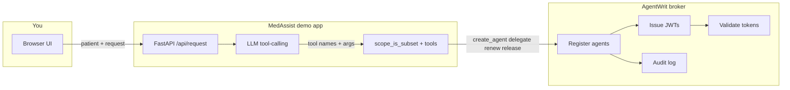
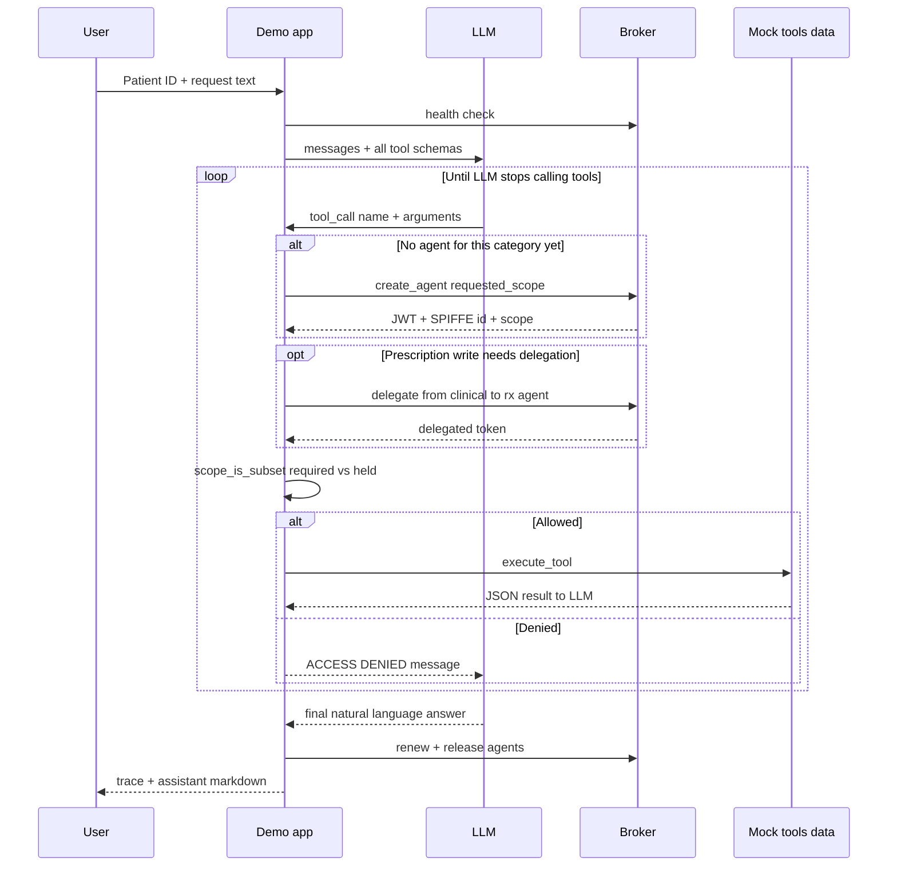
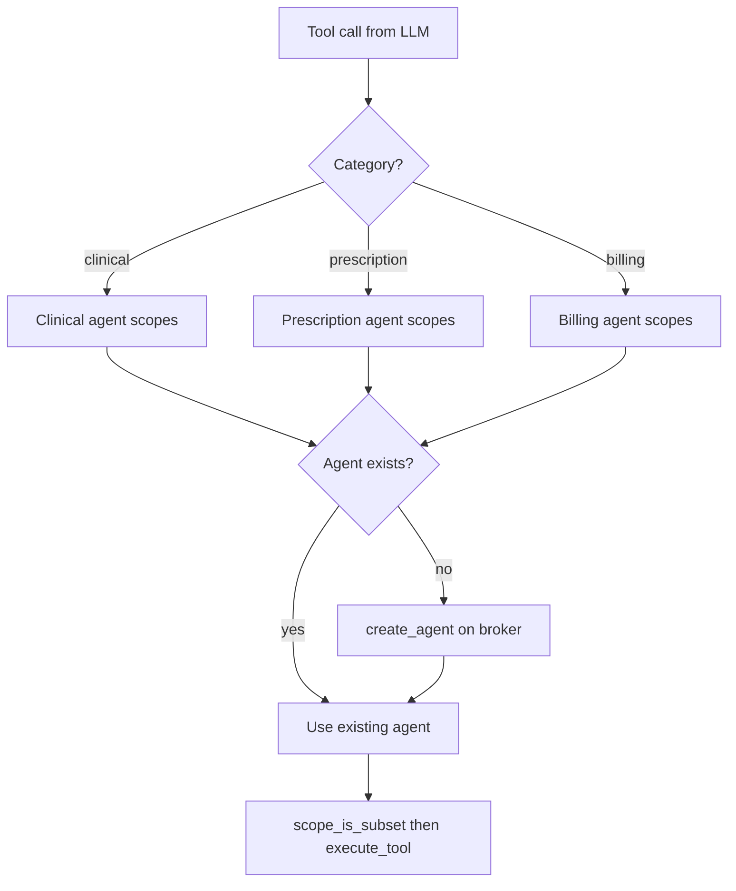
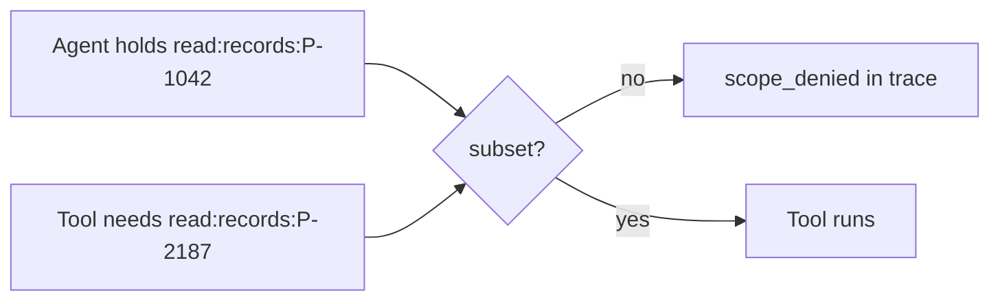
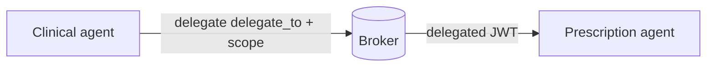

# MedAssist AI demo — beginner’s guide

This document is for **anyone new to AgentWrit** who wants to run the demo and understand **what is happening under the hood**. For a **live presentation script**, see [PRESENTERS_GUIDE.md](PRESENTERS_GUIDE.md).

---

## 1. What problem does AgentWrit solve?

Traditional setups often give every service (or every “agent”) the **same long-lived API key** with **broad access**. If one component is compromised, attackers can reach far more data than that component should ever see.

**AgentWrit** issues **short-lived credentials** tied to:

- **Who** is acting (a SPIFFE-style agent identity),
- **What task** they are doing,
- **Which scopes** they are allowed to use (often **per patient**, per action).

The **broker** is the authority: it registers apps, mints tokens, validates them, supports **delegation** (narrowing authority), **renewal**, **release**, and **revocation**, and writes an **audit trail**.

---

## 2. What is this demo?

**MedAssist AI** is a small **FastAPI** web app that simulates a healthcare workflow:

- You enter a **patient ID** (dropdown or free text) and a **plain-language request**.
- A **local LLM** (OpenAI-compatible API, e.g. vLLM with `google/gemma-4-26B-A4B-it`) chooses which **tools** to call (records, labs, billing, prescriptions, etc.).
- The app **creates broker agents on demand** with **only the scopes** needed for the tools the model selected, for **that patient**.
- Before each tool runs, the app checks **`scope_is_subset`**: if the agent does not hold the required scope, the tool is **denied** and the trace shows why.
- When a prescription write is needed, a **clinical** agent can **delegate** narrow `write:prescriptions:{patient}` authority to a **prescription** agent.
- At the end, agents **renew** (optional demo) and **release** tokens; validation proves tokens are **dead**.

You see **SPIFFE IDs**, scopes, tool calls, denials, delegation, and token lifecycle in the **Execution trace** panel, and a formatted **Assistant response** (markdown) at the bottom.

---

## 3. Diagram: big picture

**Idea:** the demo app never “trusts the LLM” for security. The **broker** decides what credentials exist; the demo **enforces** tool access against those credentials.

---

## 4. Diagram: one request, step by step

---

## 5. Diagram: how agents are spawned (dynamic)

The demo does **not** use a fixed “happy path” script. It maps **each tool** to a **category** (clinical, prescription, billing). The **first time** the LLM calls a tool in a category, an agent for that category is created **if it does not exist yet**.

Clinical agents also receive `write:prescriptions:{patient}` when applicable so they can **delegate** prescription writes to the Rx agent.

---

## 6. Diagram: scope denial (cross-patient)

Agents are scoped to **one primary patient** for the encounter. If the LLM tries `get_patient_records` for **another** patient ID, the required scope is `read:records:OTHER`, but the agent only holds `read:records:PRIMARY` — so **`scope_is_subset` fails** and the trace shows **ACCESS DENIED**.

---

## 7. Diagram: delegation (prescription write)

Delegation is **authority narrowing**: the clinical agent already has `write:prescriptions:{pid}`; it asks the broker to issue a **delegated token** for the prescription agent’s SPIFFE ID with **only** that scope (or a subset).

---

## 8. What to read in the UI

| Area | Meaning |
|------|--------|
| **Execution trace** | Ordered steps: patient lookup, broker health, LLM start, `agent_created`, `token_validated`, `tool_call` / `scope_denied`, `delegation`, `llm_response`, renew/release, `complete`. |
| **Agents spawned** | One card per agent category created this run, with SPIFFE ID and scopes. |
| **Assistant response** | Final LLM message, rendered as **markdown** (headings, lists, bold, tables). |

---

## 9. How to run (minimal)

1. **Start the broker** (from repo root): `docker compose up -d`
2. **Register the app** (once): `uv run python demo/setup.py` — copy `client_id` / `client_secret` into `demo/.env`
3. **Configure `demo/.env`**: broker URL, app credentials, admin secret for audit/revoke pages, and LLM (`LLM_BASE_URL`, `LLM_API_KEY`, `LLM_MODEL`)
4. **Run the app:** `uv run uvicorn demo.app:app --reload --port 5000`
5. Open **http://127.0.0.1:5000**

See also [`.env.example`](.env.example) for variable names.

---

## 10. Where the code lives

| Piece | Location |
|-------|----------|
| FastAPI app | [`app.py`](app.py) |
| Config (broker + LLM) | [`config.py`](config.py) |
| Main API (LLM loop, agents, trace) | [`routes/api.py`](routes/api.py) |
| Tool definitions + scope templates | [`pipeline/tools.py`](pipeline/tools.py) |
| Mock patients / data | [`data/`](data/) |
| Pages (encounter, audit, operator) | [`routes/pages.py`](routes/pages.py), [`templates/`](templates/) |
| Frontend (trace + markdown) | [`static/app.js`](static/app.js), [`static/style.css`](static/style.css) |
| Broker app registration helper | [`setup.py`](setup.py) |

---

## 11. Further reading

- **Product / technical spec:** [`.plans/specs/2026-04-08-medassist-demo-spec.md`](../.plans/specs/2026-04-08-medassist-demo-spec.md) (repo root)
- **Presenter script:** [PRESENTERS_GUIDE.md](PRESENTERS_GUIDE.md)
- **Broker API (source of truth for integration):** `broker/docs/api.md`
