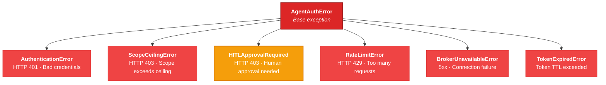

# API Reference

Complete reference for the AgentAuth Python SDK public API.

## Table of Contents

- [AgentAuthClient](#agentauthclient)
  - [Constructor](#constructor)
  - [get_token()](#get_token)
  - [delegate()](#delegate)
  - [revoke_token()](#revoke_token)
  - [validate_token()](#validate_token)
- [Exceptions](#exceptions)
  - [Exception Hierarchy](#exception-hierarchy)
  - [AgentAuthError](#agentautherror)
  - [AuthenticationError](#authenticationerror)
  - [ScopeCeilingError](#scopeceilingerror)
  - [HITLApprovalRequired](#hitlapprovalrequired)
  - [RateLimitError](#ratelimiterror)
  - [BrokerUnavailableError](#brokerunavailableerror)
  - [TokenExpiredError](#tokenexpirederror)
- [Retry Behavior](#retry-behavior)
- [Token Caching](#token-caching)
- [Thread Safety](#thread-safety)
- [Broker Endpoint Mapping](#broker-endpoint-mapping)

---

## AgentAuthClient

```python
from agentauth import AgentAuthClient
```

### Constructor

```python
AgentAuthClient(
    broker_url: str,
    client_id: str,
    client_secret: str,
    *,
    max_retries: int = 3,
    verify: bool = True,
)
```

Creates and authenticates an SDK client. The constructor authenticates your application with the broker immediately — if credentials are invalid, `AuthenticationError` is raised at construction time (fail-fast).

**Parameters:**

| Parameter | Type | Default | Description |
|-----------|------|---------|-------------|
| `broker_url` | `str` | required | Base URL of the AgentAuth broker (e.g., `https://broker.example.com`). Trailing slash is stripped automatically. |
| `client_id` | `str` | required | Application identifier from broker registration. |
| `client_secret` | `str` | required | Application secret from broker registration. **Never logged, printed, or included in any SDK output.** |
| `max_retries` | `int` | `3` | Maximum retry attempts for transient failures (5xx, 429, connection errors). |
| `verify` | `bool` | `True` | Whether to verify TLS certificates. Defaults to `True` per NIST SP 800-207 guidance. |

**Behavior:**

- Authenticates with the broker immediately via `POST /v1/app/auth`
- Caches the app JWT internally with automatic renewal (10-second buffer before expiry)
- Raises `AuthenticationError` on invalid credentials
- Sets up an internal `requests.Session` with TLS verification and JSON content type

**Example:**

```python
import os
from agentauth import AgentAuthClient

client = AgentAuthClient(
    broker_url=os.environ["AGENTAUTH_BROKER_URL"],
    client_id=os.environ["AGENTAUTH_CLIENT_ID"],
    client_secret=os.environ["AGENTAUTH_CLIENT_SECRET"],
)
```

---

### get_token

```python
client.get_token(
    agent_name: str,
    scope: list[str],
    *,
    task_id: str | None = None,
    orch_id: str | None = None,
    approval_token: str | None = None,
) -> str
```

Obtains a scoped agent credential. Handles the full 8-step flow internally: cache check → app auth → launch token → Ed25519 keygen → challenge → nonce signing → registration → caching.

**Parameters:**

| Parameter | Type | Default | Description |
|-----------|------|---------|-------------|
| `agent_name` | `str` | required | Logical name for the agent. Used as part of the cache key. |
| `scope` | `list[str]` | required | Scopes to request (e.g., `["read:data:*"]`). Must be within the app's scope ceiling. |
| `task_id` | `str \| None` | `None` | Task identifier. Appears in the JWT claims and the SPIFFE subject. Defaults to `"default"` if not provided. |
| `orch_id` | `str \| None` | `None` | Orchestrator identifier. Appears in the JWT claims and the SPIFFE subject. Defaults to `"sdk"` if not provided. |
| `approval_token` | `str \| None` | `None` | HITL approval token from the broker's approval endpoint. Pass this on retry after catching `HITLApprovalRequired`. |

**Returns:** `str` — JWT string (EdDSA-signed, three dot-separated parts).

**Raises:**

| Exception | When | What to Do |
|-----------|------|-----------|
| `HITLApprovalRequired` | Scope overlaps operator-defined HITL scopes | Present `exc.approval_id` to user, retry with `approval_token` after approval |
| `ScopeCeilingError` | Scope exceeds the app's ceiling | Fix the scope or contact your operator to expand the ceiling |
| `AuthenticationError` | App JWT expired and re-authentication failed | Check credentials |
| `BrokerUnavailableError` | All retries exhausted (5xx or connection error) | Broker is down |
| `RateLimitError` | 429 after all retries | Back off and reduce request rate |

**Caching behavior:** A second call with the same `(agent_name, frozenset(scope))` returns the cached token without any broker calls. Tokens are proactively renewed when 80% of their TTL has elapsed.

**Example:**

```python
# Basic usage
token = client.get_token("data-reader", ["read:data:*"])

# With task metadata
token = client.get_token(
    "analyzer",
    ["read:data:customers"],
    task_id="q4-analysis",
    orch_id="data-pipeline",
)

# With HITL approval (retry after catching HITLApprovalRequired)
token = client.get_token(
    "writer",
    ["write:data:records"],
    approval_token=approval_token,
)
```

---

### delegate

```python
client.delegate(
    token: str,
    to_agent_id: str,
    scope: list[str],
    ttl: int = 60,
) -> str
```

Creates a scope-attenuated delegation token for another registered agent. The delegated scope must be a subset of the delegating token's scope.

**Parameters:**

| Parameter | Type | Default | Description |
|-----------|------|---------|-------------|
| `token` | `str` | required | The delegating agent's JWT (used as Bearer auth). |
| `to_agent_id` | `str` | required | SPIFFE ID of the delegate agent (e.g., `spiffe://agentauth.local/agent/orch/task/instance`). |
| `scope` | `list[str]` | required | Scopes to delegate. **Must be a subset** of the delegating token's scope. |
| `ttl` | `int` | `60` | Lifetime of the delegated token in seconds. |

**Returns:** `str` — delegated JWT string.

**Raises:** `ScopeCeilingError` if the delegated scope exceeds the delegator's scope. `AgentAuthError` on other broker errors.

**Example:**

```python
# Get the target agent's SPIFFE ID
worker_claims = client.validate_token(worker_token)
worker_id = worker_claims["claims"]["sub"]

# Delegate a subset of the orchestrator's scope
delegated = client.delegate(
    token=orchestrator_token,
    to_agent_id=worker_id,
    scope=["read:data:results"],
    ttl=120,
)
```

---

### revoke_token

```python
client.revoke_token(token: str) -> None
```

Self-revokes an agent token. The broker marks the token's JTI as revoked and logs a `token_released` audit event.

**Parameters:**

| Parameter | Type | Description |
|-----------|------|-------------|
| `token` | `str` | The agent JWT to revoke (used as Bearer auth). |

**Returns:** `None`

**Behavior:** After revocation, the token is rejected by the broker on all subsequent requests. Downstream delegation tokens are also invalidated.

**Example:**

```python
client.revoke_token(token)
# Token is now dead — broker rejects it on all future requests
```

---

### validate_token

```python
client.validate_token(token: str) -> dict
```

Online validation of a token against the broker. This is a public endpoint — no authentication required.

**Parameters:**

| Parameter | Type | Description |
|-----------|------|-------------|
| `token` | `str` | JWT string to validate. |

**Returns:** `dict` with one of two structures:

```python
# Valid token:
{
    "valid": True,
    "claims": {
        "sub": "spiffe://agentauth.local/agent/sdk/default/a1b2c3d4",
        "scope": ["read:data:*"],
        "exp": 1741308300,
        "orch_id": "sdk",
        "task_id": "default",
        # ... other JWT claims
    }
}

# Invalid, revoked, or expired token:
{
    "valid": False,
    "error": "token revoked"  # or "token expired", "invalid signature", etc.
}
```

**Example:**

```python
result = client.validate_token(token)
if result["valid"]:
    print(f"Subject: {result['claims']['sub']}")
    print(f"Scope: {result['claims']['scope']}")
else:
    print(f"Invalid: {result.get('error')}")
```

---

## Exceptions

All exceptions are importable from `agentauth` or `agentauth.errors`.

```python
from agentauth import (
    AgentAuthError,
    AuthenticationError,
    ScopeCeilingError,
    HITLApprovalRequired,
    RateLimitError,
    BrokerUnavailableError,
    TokenExpiredError,
)
```

### Exception Hierarchy



All exceptions carry optional `status_code` and `error_code` attributes from the broker response.

---

### AgentAuthError

Base exception for all SDK errors.

| Attribute | Type | Description |
|-----------|------|-------------|
| `status_code` | `int \| None` | HTTP status code from the broker response |
| `error_code` | `str \| None` | Broker error code string (e.g., `"scope_violation"`, `"forbidden"`) |

**Usage:** Catch this to handle any SDK error generically.

```python
try:
    token = client.get_token("agent", scope)
except AgentAuthError as e:
    print(f"SDK error: {e} (HTTP {e.status_code})")
```

---

### AuthenticationError

Raised when the broker rejects app credentials (HTTP 401).

| Attribute | Type | Description |
|-----------|------|-------------|
| `client_id` | `str \| None` | The `client_id` used (for debugging — `client_secret` is **never** included) |
| `status_code` | `int \| None` | HTTP status code |
| `error_code` | `str \| None` | Broker error code |

**Common causes:** Invalid `client_id` or `client_secret`, inactive or deleted app registration.

---

### ScopeCeilingError

Raised when the requested scope exceeds the app's allowed ceiling (HTTP 403, `scope_violation` or `forbidden`).

| Attribute | Type | Description |
|-----------|------|-------------|
| `requested_scope` | `list[str] \| None` | The scope that was requested |
| `status_code` | `int \| None` | HTTP status code |
| `error_code` | `str \| None` | Broker error code |

**Resolution:** Request a narrower scope, or ask your operator to expand the app's scope ceiling.

---

### HITLApprovalRequired

Raised when the scope requires human-in-the-loop approval (HTTP 403, `hitl_approval_required`). **This is not a failure** — it is a flow control signal indicating that a human must approve before the credential can be issued.

| Attribute | Type | Description |
|-----------|------|-------------|
| `approval_id` | `str` | Unique approval request ID (e.g., `"apr-a1b2c3d4e5f6"`) |
| `expires_at` | `str` | RFC 3339 timestamp — approval must be completed before this time |

**Handling:** Present `approval_id` to a human, get their approval via the broker's approval endpoint, then retry `get_token` with the resulting `approval_token`. See the [HITL Implementation Guide](hitl-implementation-guide.md) for patterns.

---

### RateLimitError

Raised when the broker returns HTTP 429 after all retries are exhausted.

| Attribute | Type | Description |
|-----------|------|-------------|
| `retry_after` | `int \| None` | Seconds to wait before retrying (from the `Retry-After` header) |
| `status_code` | `int \| None` | HTTP status code (always 429) |
| `error_code` | `str \| None` | Broker error code |

**Note:** The SDK already respects `Retry-After` headers and retries automatically. You only see this exception if all retries were exhausted.

---

### BrokerUnavailableError

Raised when the broker is unreachable after all retry attempts. This includes persistent HTTP 5xx responses and connection errors (`requests.ConnectionError`).

---

### TokenExpiredError

Raised when an agent token has expired and automatic renewal failed.

---

## Retry Behavior

The SDK retries transient failures automatically before raising exceptions:

| Condition | Behavior | Max Attempts |
|-----------|----------|-------------|
| HTTP 2xx/3xx/4xx (except 429) | Return immediately, no retry | 1 |
| HTTP 429 (Rate Limit) | Sleep per `Retry-After` header (or exponential backoff) | `max_retries` |
| HTTP 5xx (Server Error) | Exponential backoff: 1s, 2s, 4s, ... | `max_retries` |
| Connection Error | Exponential backoff: 1s, 2s, 4s, ... | `max_retries` |

After all retries are exhausted: `BrokerUnavailableError` (5xx / connection) or `RateLimitError` (429).

**Note:** App authentication (`POST /v1/app/auth`) is **not** retried on failure — this is intentional to fail fast on invalid credentials at construction time.

---

## Token Caching

Agent tokens are cached in memory by `(agent_name, frozenset(scope))`:

| Behavior | Details |
|----------|---------|
| **Cache key** | `(agent_name, frozenset(scope))` — scope order does not matter |
| **Cache hit** | Returns cached token instantly (0 network calls) |
| **Auto-renewal** | Tokens are renewed when 80% of their TTL has elapsed |
| **Expiry eviction** | Expired tokens are removed on next access |
| **Thread safety** | Cache operations are protected by `threading.Lock` |
| **Persistence** | In-memory only — cache does not survive process restart |

```python
# These all produce cache hits (same key):
client.get_token("agent", ["read:data:*", "write:data:*"])
client.get_token("agent", ["write:data:*", "read:data:*"])  # Order doesn't matter

# This is a different cache entry (different scope):
client.get_token("agent", ["read:data:*"])
```

---

## Thread Safety

The SDK is safe for use in multi-threaded applications:

| Component | Protection |
|-----------|------------|
| App token state | `threading.Lock` — reads and writes to app JWT and expiry are synchronized |
| Token cache | `threading.Lock` — all cache operations (get, put, remove, renewal check) are synchronized |
| HTTP session | `requests.Session` — connection pooling is thread-safe |

Multiple threads can call `get_token()`, `delegate()`, `revoke_token()`, and `validate_token()` concurrently without external synchronization.

---

## Broker Endpoint Mapping

The SDK maps its public methods to these broker API endpoints:

| SDK Method | HTTP Method | Broker Endpoint | Auth |
|-----------|-------------|-----------------|------|
| Constructor | `POST` | `/v1/app/auth` | `client_id` + `client_secret` in body |
| `get_token()` | `POST` | `/v1/app/launch-tokens` | `Bearer {app_token}` |
| `get_token()` | `GET` | `/v1/challenge` | None |
| `get_token()` | `POST` | `/v1/register` | `launch_token` in body (no Bearer) |
| `delegate()` | `POST` | `/v1/delegate` | `Bearer {agent_token}` |
| `revoke_token()` | `POST` | `/v1/token/release` | `Bearer {agent_token}` |
| `validate_token()` | `POST` | `/v1/token/validate` | None (public endpoint) |

The SDK uses the same broker API as any other client — no special endpoints, no backdoors. The broker does not know it is talking to an SDK.

---

## Next Steps

| Guide | What You'll Learn |
|-------|-------------------|
| [Concepts](concepts.md) | Architecture, security model, and standards alignment |
| [Getting Started](getting-started.md) | Install the SDK and issue your first credential |
| [Developer Guide](developer-guide.md) | HITL patterns, delegation, error handling, and complete examples |
| [HITL Implementation Guide](hitl-implementation-guide.md) | Four patterns for building human approval workflows |
