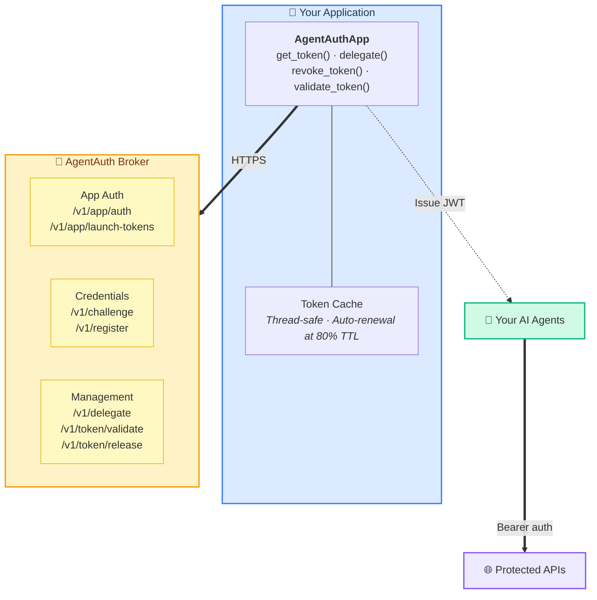
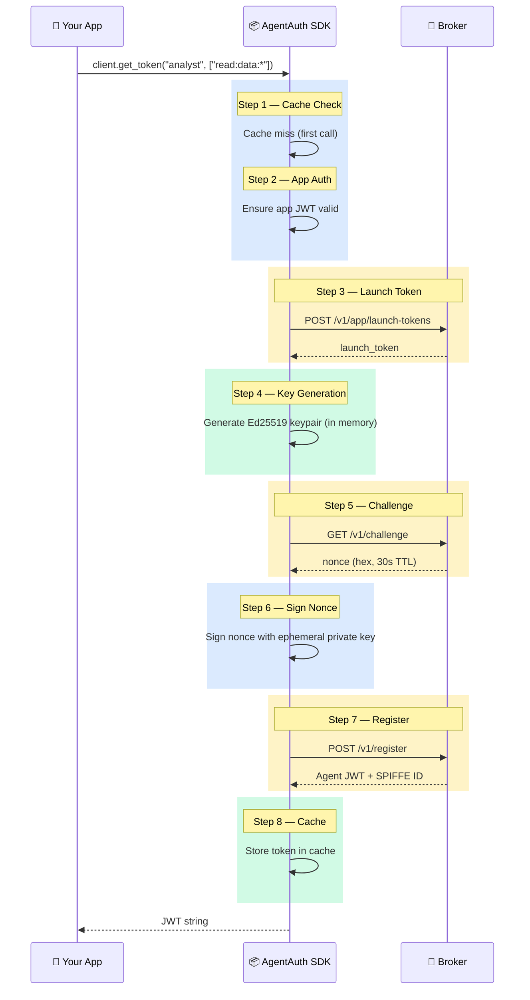
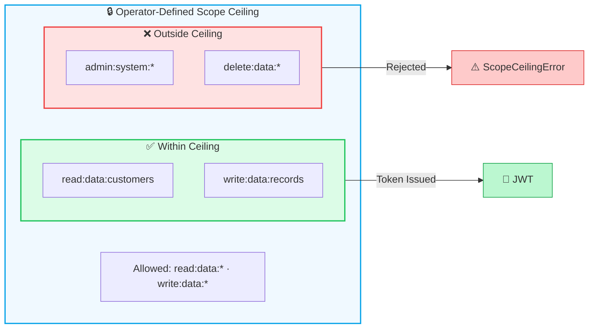
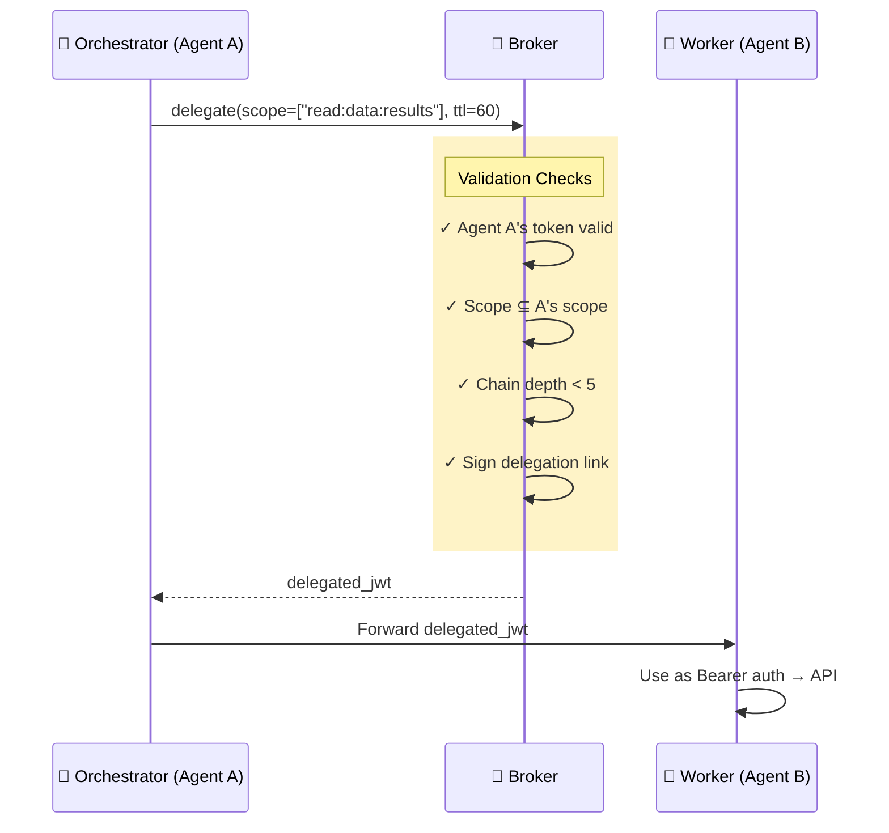
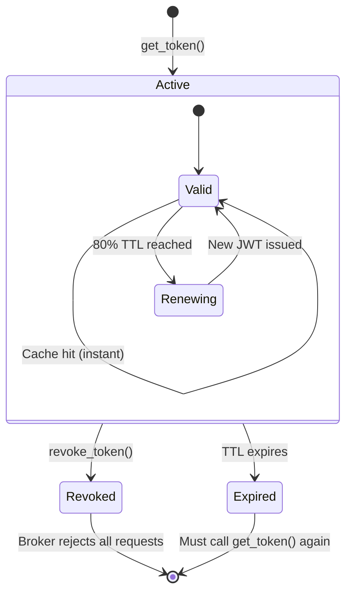

# Concepts

This document explains why AgentAuth exists, how it works, and the security model behind the SDK. Read this before writing application code — it will save you time and help you make better design decisions.

## Table of Contents

- [The Problem](#the-problem)
- [The Solution: Ephemeral Agent Credentialing](#the-solution-ephemeral-agent-credentialing)
- [Architecture Overview](#architecture-overview)
- [The Credential Flow](#the-credential-flow)
- [Why Use the SDK](#why-use-the-sdk)
- [Key Concepts](#key-concepts)
  - [Scopes](#scopes)

  - [SPIFFE Identities](#spiffe-identities)
  - [Delegation](#delegation)
  - [Token Lifecycle](#token-lifecycle)
- [Security Model](#security-model)
- [Standards Alignment](#standards-alignment)

---

## The Problem

AI agents need credentials to access databases, APIs, and file systems. Most teams solve this one of three ways — all of them dangerous:

**Shared API keys.** Every agent uses the same key. If one agent is compromised, every agent's access is compromised. You cannot tell which agent did what in the audit log. The key never expires because rotating it breaks every running agent.

**User identity inheritance.** The agent runs as the user who launched it. The agent can do everything the user can do — read anyone's data, write to any table, delete anything. The user "approved" by clicking a button, but they had no idea what the agent would actually do with their full permissions.

**Service accounts with broad scope.** An ops team creates a service account for the agent framework. It has all the permissions any agent might ever need. Permissions cannot be narrowed for specific tasks. The service account sits unused 99% of the time but remains fully active.

These approaches share three failures:

1. **Credentials live too long.** Agent tasks take minutes. Credentials last hours or days. Every extra minute is attack surface.
2. **Credentials are too broad.** An agent reading customer names has the same permissions as an agent processing payments.
3. **No human oversight where it matters.** The human "approved" at launch time, not at the moment the agent requests dangerous access.

---

## The Solution: Ephemeral Agent Credentialing

AgentAuth implements the [Ephemeral Agent Credentialing](https://github.com/devonartis/AI-Security-Blueprints/blob/main/patterns/ephemeral-agent-credentialing/versions/v1.2.md) pattern — a fundamentally different security model for AI agents:

**Every agent instance gets a unique identity.** Not a shared service account — a cryptographically unique SPIFFE identity created through Ed25519 challenge-response. Agent A and Agent B are provably different principals, even if they run the same code.

**Credentials are scoped to the specific task.** An agent analyzing customer data gets `read:data:customers` — not `read:*:*`. The scope format (`action:resource:identifier`) makes least-privilege natural rather than aspirational.

**Credentials die with the task.** Token TTL is 5 minutes by default. When the agent finishes, it revokes its own credential. A stolen token is useless within minutes.

**Delegation can only narrow, never widen.** When Agent A gives Agent B a subset of its permissions, the broker enforces that the scope strictly narrows. The delegation chain is signed at every hop.

---

## Architecture Overview



---


---

## The Credential Flow

Every call to `get_token()` executes an 8-step protocol. The SDK handles all of this internally — you call one function and get a JWT back.



On subsequent calls with the same agent name and scope, step 1 returns the cached token immediately — no network calls.

---

## Why Use the SDK

The broker exposes a JSON HTTP API. You can call it directly with `requests`. Here is what that looks like:

### Without the SDK (40+ lines, multiple failure modes)

```python
import base64, requests
from cryptography.hazmat.primitives.asymmetric.ed25519 import Ed25519PrivateKey

# Step 1: Authenticate your app
app_resp = requests.post(f"{broker_url}/v1/app/auth", json={
    "client_id": client_id, "client_secret": client_secret
})
app_token = app_resp.json()["access_token"]

# Step 2: Create a launch token
launch_resp = requests.post(f"{broker_url}/v1/app/launch-tokens",
    headers={"Authorization": f"Bearer {app_token}"},
    json={"agent_name": "reader", "allowed_scope": ["read:data:*"]})
launch_token = launch_resp.json()["launch_token"]

# Step 3: Generate Ed25519 keypair
private_key = Ed25519PrivateKey.generate()
# COMMON MISTAKE: Using .public_bytes() with DER encoding instead of .public_bytes_raw()
# The broker expects raw 32-byte keys. DER gives you 44 bytes. Registration fails.
pub_bytes = private_key.public_key().public_bytes_raw()
pub_b64 = base64.b64encode(pub_bytes).decode()

# Step 4: Get a challenge nonce
# COMMON MISTAKE: The nonce expires in 30 seconds. Slow code = failed registration.
challenge = requests.get(f"{broker_url}/v1/challenge").json()
nonce_hex = challenge["nonce"]

# Step 5: Sign the nonce
# COMMON MISTAKE: Signing the hex string instead of the decoded bytes.
nonce_bytes = bytes.fromhex(nonce_hex)
signature = base64.b64encode(private_key.sign(nonce_bytes)).decode()

# Step 6: Register the agent
reg_resp = requests.post(f"{broker_url}/v1/register", json={
    "launch_token": launch_token, "nonce": nonce_hex,
    "public_key": pub_b64, "signature": signature,
    "orch_id": "my-orch", "task_id": "my-task",
    "requested_scope": ["read:data:*"]
})
token = reg_resp.json()["access_token"]

# You STILL need to handle: token caching, renewal, app JWT renewal,
# retry with backoff, thread safety, secret protection...
```

### With the SDK (3 lines)

```python
from agentauth import AgentAuthApp

client = AgentAuthApp(broker_url, client_id, client_secret)
token = client.get_token("reader", ["read:data:*"])
```

The SDK eliminates three categories of bugs:

**Cryptographic mistakes.** DER vs raw key encoding (the most common integration issue). Signing the hex string vs the decoded bytes. Both produce valid-looking base64 that the broker rejects with an opaque "invalid signature" error.

**Timing bugs.** The nonce has a 30-second TTL. If your code does anything slow between getting the nonce and registering, registration fails silently. The SDK fetches the nonce and registers in the same flow — well under 1 second.

**State management.** App JWT renewal, token caching, retry with backoff, thread safety — all handled internally.

---

## Key Concepts

### Scopes

Scopes follow the format `action:resource:identifier`:

```
read:data:*              — read any data resource
read:data:customers      — read only customer data
write:data:records       — write to records
admin:system:*           — full admin access (if your app ceiling allows it)
```

The wildcard `*` only works in the identifier position. `read:*:*` is an invalid scope.

Your app has a **scope ceiling** set by the operator. You can request anything within that ceiling. Requesting beyond it raises `ScopeCeilingError`.



### SPIFFE Identities

Every agent gets a SPIFFE-format identity:

```
spiffe://agentauth.local/agent/{orch_id}/{task_id}/{instance_id}
```

For example: `spiffe://agentauth.local/agent/pipeline-alpha/quarterly-review/a1b2c3d4`

This identity is:
- **Unique per instance** — two agents with the same name and scope get different identities
- **Cryptographically bound** — tied to the Ed25519 keypair generated for this specific registration
- **Task-aware** — the `task_id` and `orch_id` are embedded in the identity path

### Delegation

Agent A can give Agent B a subset of its own permissions:

```python
delegated = client.delegate(
    token=agent_a_token,
    to_agent_id=agent_b_spiffe_id,
    scope=["read:data:results"],  # must be narrower than A's scope
    ttl=60,
)
```



Delegation rules:
- Scope can only **narrow** at each hop, never widen
- Maximum delegation depth is 5 hops
- Each link in the chain is cryptographically signed
- Revoking Agent A's token invalidates all downstream delegations

### Token Lifecycle



- `get_token()` executes the full 8-step flow (or returns cached token)
- Active tokens are valid for their TTL (default 5 minutes)
- `revoke_token()` invalidates immediately
- `validate_token()` checks current status against the broker
- The SDK proactively renews tokens at 80% of their TTL

---

## Security Model

The SDK enforces these security properties automatically:

| Property | How It Works |
|----------|-------------|
| **Ephemeral keys** | Every `get_token()` call generates a fresh Ed25519 keypair in memory. The private key never touches disk. Even if the process memory is dumped, the key only exists in volatile memory and goes out of scope after signing. |
| **Task-scoped tokens** | Agents can only access what they request, within the app's scope ceiling. No master keys, no broad permissions. |
| **Short TTLs** | Tokens expire in minutes. A stolen token becomes useless quickly — unlike the 24-hour OAuth tokens common in traditional systems. |

| **Scope attenuation** | Delegation can only narrow permissions. An agent cannot grant more access than it was given. |
| **Thread safety** | Token cache and app authentication state are protected by `threading.Lock`. Safe for concurrent agents in multi-threaded applications. |
| **TLS by default** | Broker connections verify TLS certificates. The `verify` parameter defaults to `True` per NIST SP 800-207 guidance. |
| **No secret leakage** | `client_secret` never appears in error messages, `repr()` output, or logs — enforced across all modules. |

---

## Standards Alignment

The SDK implements the [Ephemeral Agent Credentialing](https://github.com/devonartis/AI-Security-Blueprints/blob/main/patterns/ephemeral-agent-credentialing/versions/v1.2.md) pattern (v1.2), with six core components:

| Component | Standard | What It Does |
|-----------|----------|-------------|
| **C1: Ephemeral Identity Issuance** | NIST IR 8596 | Unique agent identity via Ed25519 challenge-response + SPIFFE ID |
| **C2: Task-Scoped Tokens** | NIST IR 8596 | `action:resource:identifier` scopes with ceiling enforcement |
| **C3: Zero-Trust Enforcement** | NIST SP 800-207 | Every request validated independently; no implicit trust |
| **C4: Expiration & Revocation** | OWASP ASI03 | Short TTLs + explicit `revoke_token()` + broker-side JTI revocation |

| **C6: Comprehensive Audit** | SOC 2 / NIST | All credential operations logged with agent identity and scope |
| **C7: Delegation Chain Verification** | IETF WIMSE | Scope attenuation + chain signing at every delegation hop |

Additional standards alignment:
- **OWASP Top 10 for Agentic AI (2026)** — Addresses ASI03 (Identity/Privilege Abuse) and ASI07 (Insecure Inter-Agent Communication)
- **Cloud Security Alliance (Aug 2025)** — Addresses fundamental IAM inadequacy for AI workloads
- **IETF draft-klrc-aiagent-auth-00 (Mar 2026)** — OAuth/WIMSE/SPIFFE framework alignment

---

## Next Steps

| Where to Go | What You'll Learn |
|-------------|-------------------|
| [Getting Started](getting-started.md) | Install the SDK, connect to a broker, issue your first credential |
| [Developer Guide](developer-guide.md) | Multi-agent delegation, error handling, complete examples |
| [API Reference](api-reference.md) | Complete method signatures, exceptions, caching behavior |
