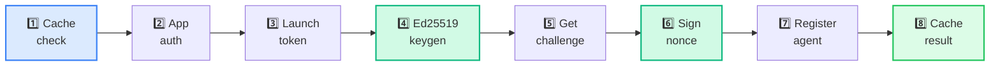
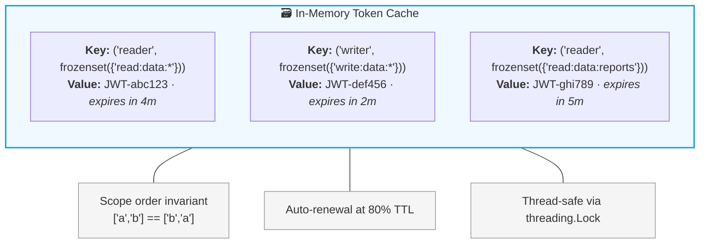
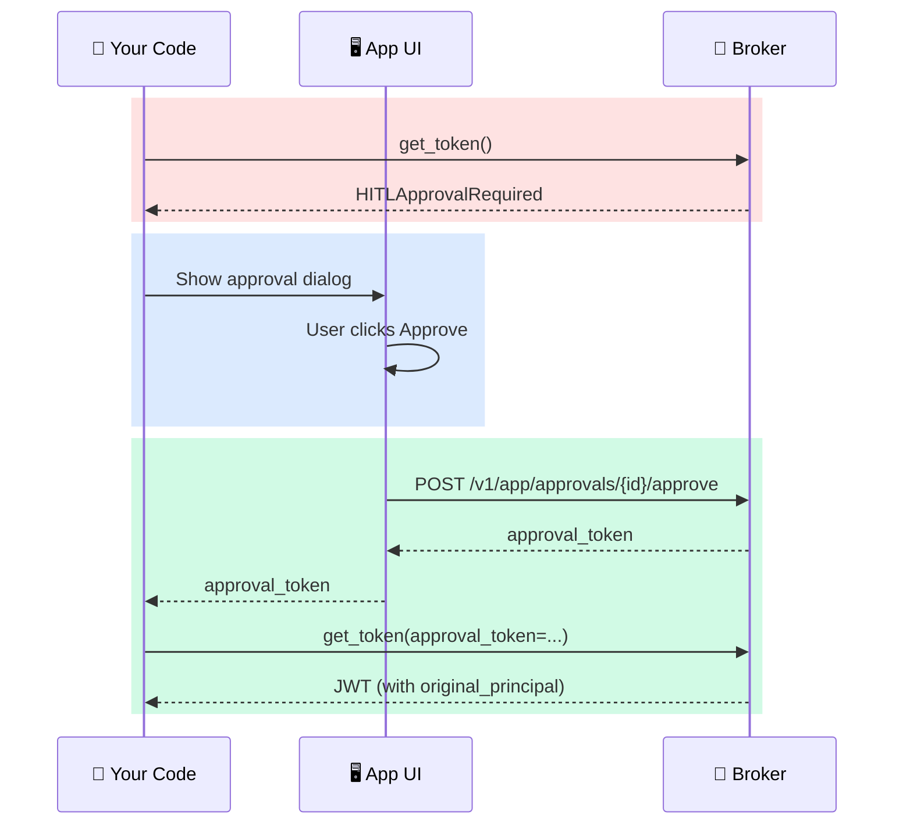
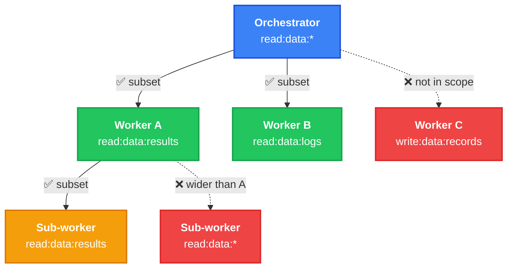
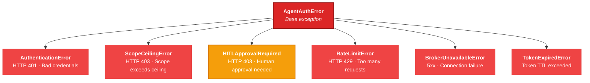
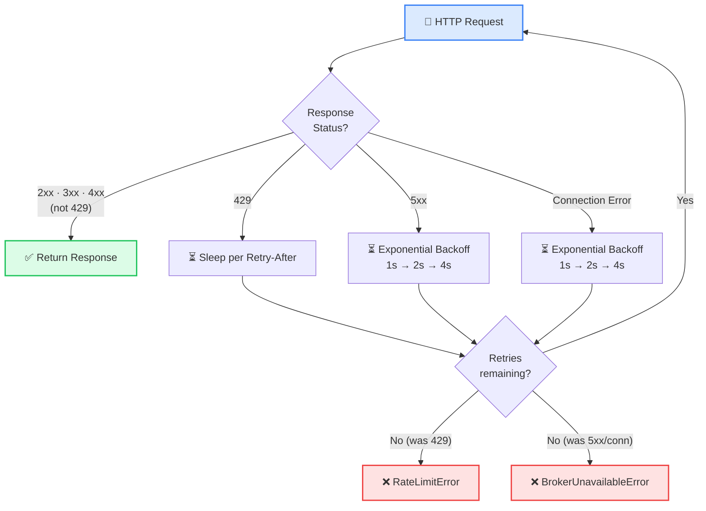

# Developer Guide

A comprehensive guide to building Python applications with the AgentAuth SDK. This covers credential management, HITL approval handling, multi-agent delegation, error handling, and framework integration.

## Table of Contents

- [Part 1: Agent Credentials](#part-1-agent-credentials)
- [Part 2: Human-in-the-Loop Approval](#part-2-human-in-the-loop-approval)
- [Part 3: Multi-Agent Delegation](#part-3-multi-agent-delegation)
- [Part 4: Credential Lifecycle](#part-4-credential-lifecycle)
- [Part 5: Error Handling](#part-5-error-handling)
- [Part 6: Security Properties](#part-6-security-properties)
- [Part 7: Framework Integration](#part-7-framework-integration)
- [Complete Example](#complete-example)

---

## Part 1: Agent Credentials

### Connecting to the Broker

Every application starts by creating an `AgentAuthClient`. This authenticates your application with the broker — think of it as logging in your application (not your agent).

```python
import os
from agentauth import AgentAuthClient

client = AgentAuthClient(
    broker_url=os.environ["AGENTAUTH_BROKER_URL"],
    client_id=os.environ["AGENTAUTH_CLIENT_ID"],
    client_secret=os.environ["AGENTAUTH_CLIENT_SECRET"],
)
```

If the credentials are wrong, `AuthenticationError` is raised immediately — fail-fast at startup, not at runtime.

### Getting a Token

```python
token = client.get_token("data-reader", ["read:data:*"])
```

Behind the scenes, the SDK executes the full 8-step protocol:



The returned `token` is a JWT string. Use it as a standard Bearer credential:

```python
import requests

response = requests.get(
    "https://your-api/data/customers",
    headers={"Authorization": f"Bearer {token}"},
)
```

### Token Caching

Call `get_token` again with the same arguments — the SDK returns the cached token without contacting the broker:

```python
token1 = client.get_token("data-reader", ["read:data:*"])
token2 = client.get_token("data-reader", ["read:data:*"])
assert token1 == token2  # Same JWT, no broker call on the second request
```

Different scopes or agent names produce different tokens:

```python
read_token = client.get_token("reader", ["read:data:*"])
write_token = client.get_token("writer", ["write:data:*"])
# Different tokens with different scopes and different SPIFFE identities
```



### Task and Orchestrator IDs

You can tag tokens with metadata that appears in the SPIFFE identity and audit log:

```python
token = client.get_token(
    "data-reader",
    ["read:data:*"],
    task_id="quarterly-analysis",
    orch_id="analytics-pipeline",
)
# SPIFFE ID: spiffe://agentauth.local/agent/analytics-pipeline/quarterly-analysis/{instance}
```

If omitted, `task_id` defaults to `"default"` and `orch_id` defaults to `"sdk"`.

---

## Part 2: Human-in-the-Loop Approval

Some operations are too sensitive for an AI agent to perform without human oversight. The operator can designate certain scopes as requiring HITL approval.

### How HITL Works in Code

When you request a HITL-gated scope, the SDK raises `HITLApprovalRequired` instead of returning a token. This is not an error — it is a flow control signal.

```python
from agentauth import HITLApprovalRequired

try:
    token = client.get_token("writer", ["write:data:records"])
except HITLApprovalRequired as approval:
    # The broker wants a human to approve this
    print(f"Approval needed: {approval.approval_id}")
    print(f"Must be approved before: {approval.expires_at}")
```

### The Approval Workflow



### Building the Approval UI

Your application is responsible for showing the approval request to the right person. A minimal implementation:

```python
import requests as http

# 1. Show the approval to your user (translate scope to plain language)
show_approval_dialog(
    approval_id=approval.approval_id,
    what_agent_wants="Write risk assessment to customer records",
    expires=approval.expires_at,
)

# 2. When the user approves, call the broker's approval endpoint
app_token = client._ensure_app_token()
resp = http.post(
    f"{broker_url}/v1/app/approvals/{approval.approval_id}/approve",
    headers={"Authorization": f"Bearer {app_token}"},
    json={"principal": "user:alice@company.com"},
)
approval_token = resp.json()["approval_token"]

# 3. Retry get_token with the approval token
token = client.get_token(
    "writer",
    ["write:data:records"],
    approval_token=approval_token,
)
```

The `original_principal` claim in the resulting JWT is cryptographically embedded — not just a log entry. Every system that validates this token can verify who approved the agent's access.

For detailed UI patterns (inline, polling, webhook, Slack), see the [HITL Implementation Guide](hitl-implementation-guide.md).

---

## Part 3: Multi-Agent Delegation

In multi-agent pipelines, an orchestrator agent might need to give a worker agent a subset of its own permissions.

### Delegating Scope

Agent A has `read:data:*` but Agent B only needs `read:data:results`:

```python
# Orchestrator gets its credential
orchestrator_token = client.get_token(
    "orchestrator",
    ["read:data:*"],
    task_id="pipeline-001",
)

# Worker registers and gets its own credential
worker_token = client.get_token(
    "worker",
    ["read:data:logs"],
    task_id="pipeline-001",
)

# Get the worker's SPIFFE ID from its token claims
worker_claims = client.validate_token(worker_token)
worker_id = worker_claims["claims"]["sub"]

# Orchestrator delegates narrower scope to the worker
delegated_token = client.delegate(
    token=orchestrator_token,
    to_agent_id=worker_id,
    scope=["read:data:results"],  # Must be subset of orchestrator's scope
    ttl=120,
)
```

### Delegation Rules



- Scope can only **narrow** at each hop, never widen
- Maximum delegation depth is 5 hops
- Each link in the chain is cryptographically signed
- Revoking Agent A's token invalidates all downstream delegations

---

## Part 4: Credential Lifecycle

### Revoking When Done

When your agent finishes its task, revoke its credentials:

```python
client.revoke_token(token)
```

After revocation, the token is immediately invalid:

```python
result = client.validate_token(token)
assert result["valid"] is False  # Broker rejects it
```

### Why Revoke?

Tokens expire naturally (default 5 minutes), but explicit revocation provides additional security:

- **Shrinks the attack window** — if a token is stolen, it is already dead
- **Signals task completion** — the broker logs `token_released` in the audit trail
- **Demonstrates intent** — the agent explicitly surrendered access

### Online Validation

Validate any token against the broker at any time:

```python
result = client.validate_token(token)

if result["valid"]:
    claims = result["claims"]
    print(f"Subject: {claims['sub']}")      # SPIFFE ID
    print(f"Scope: {claims['scope']}")       # Granted scope
    print(f"Expires: {claims['exp']}")       # Expiration timestamp
else:
    print(f"Invalid: {result.get('error')}")  # "token revoked", "token expired", etc.
```

---

## Part 5: Error Handling

### Exception Hierarchy

All SDK exceptions inherit from `AgentAuthError`, so you can catch broadly or narrowly:



```python
from agentauth import AgentAuthError, HITLApprovalRequired, ScopeCeilingError

try:
    token = client.get_token("agent", scope)
except HITLApprovalRequired:
    # Handle HITL flow specifically
    ...
except ScopeCeilingError as e:
    # Fix the scope or contact your operator
    print(f"Scope too broad: {e}")
except AgentAuthError:
    # Catch everything else from the SDK
    ...
```

### Scope Ceiling Violations

If you request a scope your app is not allowed to have:

```python
from agentauth import ScopeCeilingError

try:
    token = client.get_token("rogue", ["admin:everything:*"])
except ScopeCeilingError as e:
    print(e)
    # "requested scopes exceed app ceiling; allowed: [read:data:* write:data:*]"
```

### Broker Unavailability

The SDK retries transient failures with exponential backoff automatically. You only see `BrokerUnavailableError` if all retries are exhausted:

```python
from agentauth import BrokerUnavailableError

try:
    token = client.get_token("agent", ["read:data:*"])
except BrokerUnavailableError:
    # All retries exhausted — broker is down
    ...
```

### Rate Limiting

The SDK respects `Retry-After` headers automatically. `RateLimitError` is raised only when all retries are exhausted:

```python
from agentauth import RateLimitError

try:
    token = client.get_token("agent", ["read:data:*"])
except RateLimitError as e:
    print(f"Retry after {e.retry_after} seconds")
```

### Retry Behavior Summary



---

## Part 6: Security Properties

When you use this SDK, these security properties are enforced automatically:

| Property | What It Means For You |
|----------|----------------------|
| **Ephemeral keys** | Every `get_token` call generates a fresh Ed25519 keypair in memory. The private key never touches disk. Even if your process is dumped, the key only exists in volatile memory. |
| **Task-scoped tokens** | Agents can only access what they request, within the app's scope ceiling. No master keys. |
| **Short TTLs** | Tokens expire in minutes. A stolen token is useless quickly. |
| **HITL provenance** | When a human approves, their identity is in the JWT — not just in a log. Every downstream system can verify who authorized the action. |
| **Scope attenuation** | Delegation can only narrow permissions. An agent cannot grant more access than it has. |
| **Thread safety** | Token cache and app auth state are protected by locks. Safe for concurrent agents. |
| **TLS by default** | Broker connections verify TLS certificates. No silent `verify=False`. |
| **No secret leakage** | `client_secret` never appears in error messages, repr output, or logs. |

---

## Part 7: Framework Integration

### FastAPI

```python
from contextlib import asynccontextmanager
from fastapi import FastAPI, Depends
from agentauth import AgentAuthClient

# Initialize once at startup
client: AgentAuthClient | None = None

@asynccontextmanager
async def lifespan(app: FastAPI):
    global client
    client = AgentAuthClient(broker_url, client_id, client_secret)
    yield

app = FastAPI(lifespan=lifespan)

def get_client() -> AgentAuthClient:
    assert client is not None
    return client

@app.post("/analyze")
def analyze(client: AgentAuthClient = Depends(get_client)):
    token = client.get_token("analyzer", ["read:data:*"])
    # Use the token...
    return {"status": "complete"}
```

### Flask

```python
from flask import Flask
from agentauth import AgentAuthClient

app = Flask(__name__)

# Initialize once at module level
client = AgentAuthClient(broker_url, client_id, client_secret)

@app.route("/analyze", methods=["POST"])
def analyze():
    token = client.get_token("analyzer", ["read:data:*"])
    # Use the token...
    return {"status": "complete"}
```

### Background Workers (Celery)

```python
from celery import Celery
from agentauth import AgentAuthClient, HITLApprovalRequired

app = Celery("tasks", broker="redis://localhost:6379")

# Initialize per-worker (one client per process)
client = AgentAuthClient(broker_url, client_id, client_secret)

@app.task
def process_data(task_id: str):
    token = client.get_token(
        "worker",
        ["read:data:*"],
        task_id=task_id,
    )
    try:
        # Do work with the token...
        pass
    finally:
        client.revoke_token(token)
```

---

## Complete Example

A data pipeline agent that reads, analyzes, writes (with HITL), and cleans up:

```python
"""Data pipeline agent with credential lifecycle management."""

import os
import requests as http
from agentauth import AgentAuthClient, HITLApprovalRequired

# Connect to the broker
client = AgentAuthClient(
    broker_url=os.environ["AGENTAUTH_BROKER_URL"],
    client_id=os.environ["AGENTAUTH_CLIENT_ID"],
    client_secret=os.environ["AGENTAUTH_CLIENT_SECRET"],
)

# Step 1: Get read credentials (automatic, no approval needed)
read_token = client.get_token(
    "data-reader",
    ["read:data:*"],
    task_id="quarterly-analysis",
    orch_id="analytics-pipeline",
)
print(f"Read token issued: {read_token[:40]}...")

# Step 2: Use the read token to access data
data = http.get(
    "https://api.internal/customers",
    headers={"Authorization": f"Bearer {read_token}"},
).json()
print(f"Read {len(data)} customer records")

# Step 3: Request write credentials (may require HITL approval)
try:
    write_token = client.get_token(
        "risk-writer",
        ["write:data:records"],
        task_id="quarterly-analysis",
    )
except HITLApprovalRequired as approval:
    print(f"Human approval needed: {approval.approval_id}")

    # In production: show approval UI to the human
    # This is a simplified example — see HITL Implementation Guide
    # for full patterns
    approval_token = get_approval_from_human(approval.approval_id)

    write_token = client.get_token(
        "risk-writer",
        ["write:data:records"],
        approval_token=approval_token,
    )
    print("Write token issued (with human approval)")

# Step 4: Write results using the approved credential
http.post(
    "https://api.internal/risk-assessments",
    headers={"Authorization": f"Bearer {write_token}"},
    json={"customer": "TechStart Inc", "risk": "medium"},
)

# Step 5: Revoke all credentials when done
client.revoke_token(read_token)
client.revoke_token(write_token)
print("All credentials revoked. Pipeline complete.")
```

---

## Next Steps

| Guide | What You'll Learn |
|-------|-------------------|
| [HITL Implementation Guide](hitl-implementation-guide.md) | Four patterns for building human approval workflows |
| [API Reference](api-reference.md) | Complete method signatures and exception reference |
| [Concepts](concepts.md) | Architecture, security model, and standards alignment |
