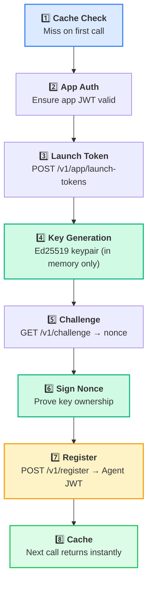

# Getting Started

Get your first agent credential in 5 minutes.

## Table of Contents

- [Prerequisites](#prerequisites)
- [Installation](#installation)
- [Obtain Credentials](#obtain-credentials)
- [Connect and Authenticate](#connect-and-authenticate)
- [Issue Your First Token](#issue-your-first-token)
- [Use the Token](#use-the-token)
- [Revoke When Done](#revoke-when-done)
- [What Just Happened](#what-just-happened)
- [Next Steps](#next-steps)

---

## Prerequisites

- **Python 3.10+**
- A running [AgentAuth broker](https://github.com/devonartis/agentAuth) instance
- App credentials (`client_id` and `client_secret`) from your broker operator

## Installation

Using [uv](https://docs.astral.sh/uv/) (recommended):

```bash
uv add git+https://github.com/devonartis/agentauth-python-sdk
```

Using pip:

```bash
pip install git+https://github.com/devonartis/agentauth-python-sdk
```

The SDK depends on `requests` (HTTP) and `cryptography` (Ed25519 operations). Both are installed automatically.

---

## Obtain Credentials

Your broker operator provides two values when they register your application:

| Value | Purpose |
|-------|---------|
| `client_id` | Identifies your application to the broker |
| `client_secret` | Authenticates your application (never logged by the SDK) |

Store these as environment variables — never hardcode them in source:

```bash
export AGENTAUTH_BROKER_URL="https://broker.yourcompany.com"
export AGENTAUTH_CLIENT_ID="your-client-id"
export AGENTAUTH_CLIENT_SECRET="your-client-secret"
```

> **Note:** If you are the broker operator, register an app with:
> ```bash
> aactl app register --name your-app --scopes "read:data:*,write:data:*"
> ```

---

## Connect and Authenticate

```python
import os
from agentauth import AgentAuthClient

client = AgentAuthClient(
    broker_url=os.environ["AGENTAUTH_BROKER_URL"],
    client_id=os.environ["AGENTAUTH_CLIENT_ID"],
    client_secret=os.environ["AGENTAUTH_CLIENT_SECRET"],
)
```

The client authenticates your application with the broker immediately on creation. If the credentials are wrong, `AuthenticationError` is raised right here — you'll know at startup, not at runtime.

---

## Issue Your First Token

```python
token = client.get_token("my-agent", ["read:data:*"])
```

That's it. `token` is a JWT string scoped to `read:data:*`.

---

## Use the Token

The token works as a standard Bearer credential with any HTTP API that validates against the broker:

```python
import requests

resp = requests.get(
    "https://your-api/data/customers",
    headers={"Authorization": f"Bearer {token}"},
)
print(resp.json())
```

---

## Revoke When Done

When your agent finishes its task, revoke the credential:

```python
client.revoke_token(token)
```

After revocation, the broker rejects the token on all future requests. This shrinks the attack window — even if the token was stolen, it is already dead.

---

## What Just Happened

The SDK executed an 8-step protocol inside that single `get_token()` call:



On subsequent calls with the same agent name and scope, step 1 returns the cached token immediately — zero network calls.

---

## Next Steps

| Guide | What You'll Learn |
|-------|-------------------|
| [Concepts](concepts.md) | Architecture, security model, and why AgentAuth works this way |
| [Developer Guide](developer-guide.md) | Multi-agent delegation, error handling, framework integration, complete examples |
| [API Reference](api-reference.md) | Complete method signatures and exception reference |
