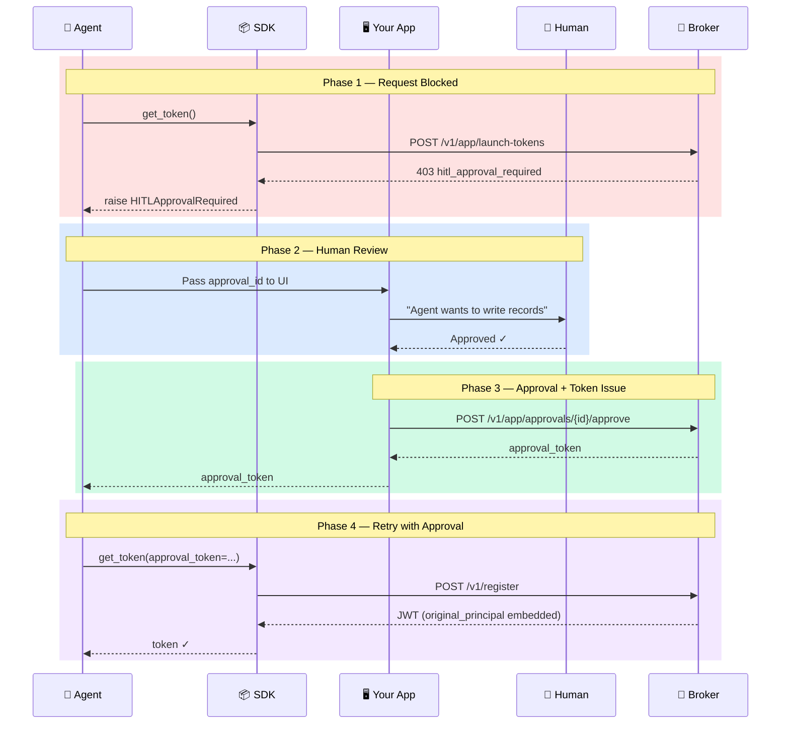

# HITL Implementation Guide

How to build the human-in-the-loop approval experience in your application. This guide covers four integration patterns — adapt them to your framework and UI.

## Table of Contents

- [Overview](#overview)
- [What the SDK Gives You](#what-the-sdk-gives-you)
- [What You Must Build](#what-you-must-build)
- [Pattern 1: Inline Approval (Synchronous)](#pattern-1-inline-approval-synchronous)
- [Pattern 2: Polling (Asynchronous Web App)](#pattern-2-polling-asynchronous-web-app)
- [Pattern 3: Notification + Callback (Different Approver)](#pattern-3-notification--callback-different-approver)
- [Pattern 4: Chat-Based Approval (Slack / Teams)](#pattern-4-chat-based-approval-slack--teams)
- [The Approval API Call](#the-approval-api-call)
- [Common Mistakes to Avoid](#common-mistakes-to-avoid)

---

## Overview

When an agent requests a scope that the operator has designated as HITL-gated, the broker refuses to issue a credential until a human explicitly approves. The approval flow looks like this:



The SDK handles steps 1–2 and the final token retrieval. Steps 3–5 (the approval UI) are your responsibility.

---

## What the SDK Gives You

When `HITLApprovalRequired` is raised, you have:

```python
try:
    token = client.get_token("writer", ["write:data:records"])
except HITLApprovalRequired as e:
    e.approval_id   # "apr-a1b2c3d4e5f6" — unique ID for this request
    e.expires_at    # "2026-03-07T12:05:00Z" — deadline for the decision
```

You also need the app-level JWT to call the approval API:

```python
app_token = client._ensure_app_token()
```

---

## What You Must Build

The approval dialog should answer three questions for the human:

1. **What** does the agent want to do? (the requested scope, in plain language)
2. **Why** is it asking? (the task context — what pipeline, what data)
3. **What happens** if they approve? (the credential is issued with their name on it)

Never show raw scope strings to end-users. Translate them:

```python
SCOPE_DESCRIPTIONS = {
    "write:data:records": "Write risk assessment to customer records",
    "write:data:transfers": "Execute a financial transfer",
    "write:data:reports": "Generate and save an analysis report",
    "read:data:ssn": "Access customer social security numbers",
}

def describe_scope(scope: str) -> str:
    return SCOPE_DESCRIPTIONS.get(scope, scope)
```

---

## Pattern 1: Inline Approval (Synchronous)

The simplest pattern. Your application blocks and waits for the user to approve in the same request/response cycle.

**Best for:** CLI tools, Jupyter notebooks, internal scripts where the user is at the terminal.

```python
from agentauth import AgentAuthClient, HITLApprovalRequired
import requests

client = AgentAuthClient(broker_url, client_id, client_secret)

def get_write_credential(agent_name: str, scope: list[str]) -> str:
    """Get a credential, prompting for approval if needed."""
    try:
        return client.get_token(agent_name, scope)
    except HITLApprovalRequired as e:
        print(f"\nAgent '{agent_name}' needs approval for: {scope}")
        print(f"Approval ID: {e.approval_id}")
        print(f"Expires: {e.expires_at}")

        decision = input("Approve? (y/n): ").strip().lower()
        if decision != "y":
            raise RuntimeError("User denied the request")

        principal = input("Your identity (e.g., user:alice@company.com): ").strip()

        # Call the broker to approve
        app_token = client._ensure_app_token()
        resp = requests.post(
            f"{broker_url}/v1/app/approvals/{e.approval_id}/approve",
            headers={"Authorization": f"Bearer {app_token}"},
            json={"principal": principal},
        )
        approval_token = resp.json()["approval_token"]

        # Retry with the approval
        return client.get_token(agent_name, scope, approval_token=approval_token)
```

---

## Pattern 2: Polling (Asynchronous Web App)

For web applications where the user is in a browser. When HITL is triggered, the backend stores the pending approval and returns immediately. The frontend polls until the user decides.

**Best for:** Web apps where the approver is the same user who triggered the agent.

### Backend

```python
pending_approvals: dict[str, dict] = {}  # In production: use a database

@app.post("/api/get-token")
def request_token(agent_name: str, scope: str):
    scope_list = [s.strip() for s in scope.split(",")]
    try:
        token = client.get_token(agent_name, scope_list)
        return {"status": "issued", "token": token}
    except HITLApprovalRequired as e:
        pending_approvals[e.approval_id] = {
            "agent_name": agent_name,
            "scope": scope,
            "approval_id": e.approval_id,
            "expires_at": e.expires_at,
        }
        return {
            "status": "needs_approval",
            "approval_id": e.approval_id,
            "expires_at": e.expires_at,
        }

@app.get("/api/approval/{approval_id}")
def check_approval(approval_id: str):
    """Frontend polls this endpoint."""
    pending = pending_approvals.get(approval_id)
    if not pending:
        return {"status": "unknown"}
    if "token" in pending:
        return {"status": "approved", "token": pending["token"]}
    if pending.get("denied"):
        return {"status": "denied"}
    return {"status": "pending"}

@app.post("/api/approve/{approval_id}")
def approve(approval_id: str, principal: str):
    """User clicks Approve in the UI."""
    app_token = client._ensure_app_token()
    resp = requests.post(
        f"{broker_url}/v1/app/approvals/{approval_id}/approve",
        headers={"Authorization": f"Bearer {app_token}"},
        json={"principal": principal},
    )
    approval_token = resp.json()["approval_token"]

    pending = pending_approvals[approval_id]
    scope_list = [s.strip() for s in pending["scope"].split(",")]
    token = client.get_token(
        pending["agent_name"], scope_list, approval_token=approval_token
    )
    pending["token"] = token
    return {"status": "approved", "token": token}

@app.post("/api/deny/{approval_id}")
def deny(approval_id: str, reason: str = "Denied by user"):
    app_token = client._ensure_app_token()
    requests.post(
        f"{broker_url}/v1/app/approvals/{approval_id}/deny",
        headers={"Authorization": f"Bearer {app_token}"},
        json={"reason": reason},
    )
    pending_approvals[approval_id]["denied"] = True
    return {"status": "denied"}
```

### Frontend (polling)

```javascript
async function requestToken(agentName, scope) {
    const resp = await fetch("/api/get-token", {
        method: "POST",
        headers: {"Content-Type": "application/json"},
        body: JSON.stringify({agent_name: agentName, scope}),
    });
    const data = await resp.json();

    if (data.status === "issued") {
        onTokenIssued(data.token);
    } else if (data.status === "needs_approval") {
        showApprovalDialog(data.approval_id, data.expires_at);
    }
}

async function approve(approvalId) {
    const principal = document.getElementById("principal-input").value;
    const resp = await fetch(`/api/approve/${approvalId}`, {
        method: "POST",
        headers: {"Content-Type": "application/json"},
        body: JSON.stringify({principal}),
    });
    const data = await resp.json();
    if (data.status === "approved") {
        hideApprovalDialog();
        onTokenIssued(data.token);
    }
}
```

---

## Pattern 3: Notification + Callback (Different Approver)

When the person who needs to approve is not the person running the agent. The agent runs in a pipeline, and a manager or compliance officer receives a notification to approve.

**Best for:** Pipeline agents, compliance workflows, financial operations requiring manager sign-off.

```python
import smtplib
from email.message import EmailMessage

def notify_approver(approval_id: str, agent_name: str, scope: str,
                    approver_email: str, expires_at: str):
    """Send an approval request to the designated approver."""
    msg = EmailMessage()
    msg["Subject"] = f"Agent approval needed: {agent_name}"
    msg["From"] = "agentauth@company.com"
    msg["To"] = approver_email
    msg.set_content(f"""
An AI agent needs your approval to proceed.

Agent: {agent_name}
Requested access: {scope}
Approval ID: {approval_id}
Expires: {expires_at}

Approve: https://your-app.com/approve/{approval_id}
Deny: https://your-app.com/deny/{approval_id}
    """)
    with smtplib.SMTP("smtp.company.com") as smtp:
        smtp.send_message(msg)
```

Then your agent polls for the decision:

```python
import time

def wait_for_approval(approval_id: str, timeout_seconds: int = 300,
                      poll_interval: int = 5) -> bool:
    """Poll until the approval is resolved or expires."""
    app_token = client._ensure_app_token()
    deadline = time.time() + timeout_seconds

    while time.time() < deadline:
        resp = requests.get(
            f"{broker_url}/v1/app/approvals/{approval_id}",
            headers={"Authorization": f"Bearer {app_token}"},
        )
        status = resp.json()["status"]

        if status == "approved":
            return True
        elif status in ("denied", "expired"):
            return False

        time.sleep(poll_interval)

    return False  # Timed out
```

---

## Pattern 4: Chat-Based Approval (Slack / Teams)

For teams that live in messaging platforms. The agent sends an approval request to a channel, and someone clicks to approve.

**Best for:** DevOps teams, data teams, any group that uses Slack/Teams as their primary communication tool.

```python
import requests as http

def send_slack_approval(webhook_url: str, approval_id: str,
                        agent_name: str, scope: str):
    """Post an approval request to a Slack channel."""
    http.post(webhook_url, json={
        "blocks": [
            {
                "type": "section",
                "text": {
                    "type": "mrkdwn",
                    "text": (
                        f"*Agent approval needed*\n"
                        f"Agent `{agent_name}` wants: `{scope}`\n"
                        f"Approval ID: `{approval_id}`"
                    ),
                }
            },
            {
                "type": "actions",
                "elements": [
                    {
                        "type": "button",
                        "text": {"type": "plain_text", "text": "Approve"},
                        "style": "primary",
                        "action_id": f"approve_{approval_id}",
                        "url": f"https://your-app.com/approve/{approval_id}"
                    },
                    {
                        "type": "button",
                        "text": {"type": "plain_text", "text": "Deny"},
                        "style": "danger",
                        "action_id": f"deny_{approval_id}",
                        "url": f"https://your-app.com/deny/{approval_id}"
                    }
                ]
            }
        ]
    })
```

---

## The Approval API Call

Regardless of which pattern you use, the approval itself is the same HTTP call to the broker:

### Approve

```python
import requests

resp = requests.post(
    f"{broker_url}/v1/app/approvals/{approval_id}/approve",
    headers={"Authorization": f"Bearer {app_token}"},
    json={"principal": "user:alice@company.com"},
)
approval_token = resp.json()["approval_token"]

# Then retry get_token with the approval_token
token = client.get_token(agent_name, scope, approval_token=approval_token)
```

### Deny

```python
requests.post(
    f"{broker_url}/v1/app/approvals/{approval_id}/deny",
    headers={"Authorization": f"Bearer {app_token}"},
    json={"reason": "Scope too broad for this task"},
)
```

### Key Points

- The approval endpoint requires the **app JWT** (from `client._ensure_app_token()`), not an admin token
- The `principal` must start with `user:` — this is the verified identity of the approving human
- The `approval_token` is **one-time-use** — it can only be used once in a `get_token` retry
- The `approval_token` is **scope-locked** — it only works for the scope that was originally requested

---

## Common Mistakes to Avoid

**Don't auto-approve.** The entire point of HITL is that a human makes the decision. If your code auto-approves, you've built accountability theater — the credential looks like it was approved, but no human actually reviewed it.

**Don't show raw scope strings.** `write:data:records` means nothing to a business user. Translate scopes to plain language descriptions of what the agent will actually do.

**Don't let the agent compose the approval message.** This is the LITL (Lies-in-the-Loop) attack — the agent crafts a misleading description of what it wants to do. Your application should generate the approval message from the scope, not from anything the LLM produced.

**Don't skip the principal.** The `principal` field is not optional decoration. It is cryptographically embedded in the issued JWT. If you hardcode `"user:system"`, you have defeated the audit trail.

**Don't ignore `expires_at`.** Approval requests expire. If your UI does not show the deadline, the user might click Approve after it has already expired and receive a confusing error.

---

## Next Steps

| Guide | What You'll Learn |
|-------|-------------------|
| [Developer Guide](developer-guide.md) | Multi-agent delegation, error handling, complete examples |
| [API Reference](api-reference.md) | Complete method signatures and exception reference |
| [Concepts](concepts.md) | Architecture and security model |
